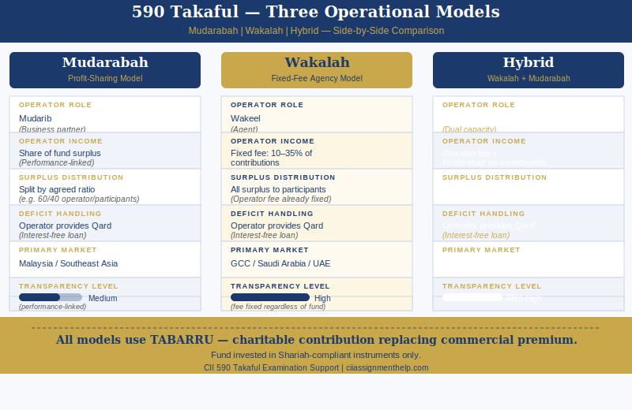

# 590 Assignment Help — Principles of Takaful | CII Advanced Diploma in Insurance

Unit 590 — Principles of Takaful is a 30-credit Level 6 written examination unit within the CII Advanced Diploma in Insurance. It covers Islamic insurance (Takaful) principles, models, regulatory standards, and market structures across the two most important global Takaful markets — Malaysia and the Gulf Cooperative Council (GCC). A 590 Arabic-language variant is available for Arabic-speaking students: the examination is offered in Arabic, with identical syllabus content to the English version. The unit is taken by insurance professionals working in Gulf/MENA and Malaysian markets, Islamic finance practitioners, and those working with or entering Takaful operators. The written exam requires candidates to explain why conventional insurance is problematic under Shariah law, compare Takaful operational models with precision, and apply an understanding of market structures in Malaysia and the GCC to examination scenarios.

---

## What Is Takaful? — Defining Islamic Insurance and Why It Exists

Takaful is a system of Islamic cooperative insurance operating on the principle of mutual contribution and shared risk. Participants contribute to a shared fund with the intention of helping fellow participants who suffer covered losses. The fundamental difference from conventional insurance is contractual: conventional insurance is a commercial exchange (premium for indemnity); Takaful replaces this exchange with tabarru — a voluntary charitable contribution to a mutual fund.

Takaful exists because conventional insurance presents three conflicts with Shariah law. Each prohibition must be understood precisely before the Takaful structure can be evaluated.

### Why Conventional Insurance Is Haram — Riba, Gharar and Maysir

**Riba (prohibition of interest)**: Conventional insurance companies invest the premiums they collect in interest-bearing financial instruments — government bonds, corporate bonds, and money market instruments. This generates riba (interest income) for the insurer. Under Shariah, earning or paying riba is prohibited. An observant Muslim participating in conventional insurance contributes to a commercial structure that profits from interest — making participation problematic regardless of the policy's purpose.

**Gharar (excessive uncertainty)**: Gharar refers to excessive or deceptive uncertainty in a contractual arrangement. In conventional insurance, the insured pays a premium without certainty of receiving any benefit — if no insured event occurs, the premium is lost with nothing returned. The insurer faces reciprocal uncertainty about ultimate claims costs. The majority Shariah position is that this level of bilateral uncertainty in a commercial exchange contract is impermissible. The key qualifier is "excessive" — not all uncertainty is prohibited, but a contract where either party cannot determine whether they will receive value is considered gharar al-fahish (excessive uncertainty).

**Maysir (gambling/speculation)**: The conventional insurance contract can be characterised as wagering on whether a loss event will occur — the insured "wins" a claim payout if the insured event occurs and effectively "loses" the premium if it does not. This speculative, chance-based element parallels gambling. Takaful addresses maysir by changing the nature of the participant's contribution: tabarru is a charitable donation, not a bet. A donation cannot be "lost" in the gambling sense — it is given with charitable intent from the outset.

### How Takaful Solves the Prohibitions — the Tabarru Principle

Takaful substitutes the commercial premium payment with tabarru — a voluntary donation or contribution from each participant to a shared Takaful fund, made with the explicit intention of helping other participants who suffer losses. This structural change resolves all three prohibitions:

- **Riba**: The Takaful fund is invested exclusively in Shariah-compliant instruments — sukuk (Islamic bonds), equity in halal businesses, and property. No interest-bearing instruments are used.
- **Gharar**: Because the participant's contribution is a tabarru (charitable donation) rather than a commercial exchange, the uncertainty about whether a claim will be paid does not create impermissible gharar — the participant gives with charitable intent, not in expectation of a commercial return.
- **Maysir**: The tabarru framework eliminates wagering — the participant donates to the mutual fund regardless of whether they will make a claim.

The Takaful operator manages the fund on behalf of the participants under one of three governance models, each with distinct commercial structures.

---

## The Three Takaful Models — Mudarabah, Wakalah and Hybrid

590 requires precise comparative analysis of the three Takaful operational models. The distinction between Mudarabah and Wakalah in particular is a core examination topic.

### Mudarabah Model

In the Mudarabah (profit-sharing) model, the Takaful operator acts as Mudarib — entrepreneur or business partner — and manages the Takaful fund on behalf of participants. Participants contribute tabarru to the fund; the operator manages underwriting, investments, and claims.

**Surplus distribution**: After claims, retakaful costs, and expenses have been deducted, any surplus remaining in the fund is shared between the participants and the operator in a pre-agreed ratio specified in the contract — for example, 60% to participants and 40% to the operator. The operator's income is therefore contingent on fund performance: no surplus means no operator share from that source.

**Investment income**: In some Mudarabah structures, the profit-sharing ratio also applies to investment returns — the operator shares in the investment income generated by managing the Takaful fund's assets.

**Deficit management**: If claims exceed contributions and reserves, creating a fund deficit, the operator provides a Qard — an interest-free loan — to restore the fund to solvency. This Qard is repaid from future surpluses.

**Market prevalence**: Mudarabah is the traditional Takaful model and remains dominant in Malaysia and Southeast Asia generally.

**Limitation**: The profit-sharing mechanism creates a potential conflict of interest — the operator benefits from generating higher surpluses and investment returns, which can create pressure on claims management decisions.

### Wakalah Model

In the Wakalah (agency) model, the Takaful operator acts as Wakeel — agent — on behalf of participants. Rather than sharing in fund performance, the operator charges a Wakalah fee: a fixed percentage of contributions, typically between 10% and 35%, specified in the contract at inception.

**Surplus distribution**: Because the operator's income is the fixed Wakalah fee rather than a share of surplus, the entire fund surplus after claims and retakaful costs belongs to the participants. The operator has no financial interest in the fund's claims experience or investment returns.

**Transparency advantage**: The Wakalah model is preferred in GCC markets precisely because the fixed fee structure is transparent — the operator's commercial interest is limited to the agency fee, removing the conflict-of-interest concern associated with Mudarabah surplus-sharing.

**Deficit management**: Identical Qard mechanism applies — the operator provides an interest-free loan to cover deficits, repaid from future surpluses.

**Market prevalence**: Wakalah is the dominant model in Saudi Arabia (mandated by SAMA for general Takaful), UAE, Bahrain, and across the GCC. It is also the model specified in AAOIFI Shariah Standard No. 26.

### Hybrid Wakalah-Mudarabah and Waqf Models

**Hybrid model**: The most common structure in Malaysia applies Wakalah fee principles to the underwriting management function (covering the operator's cost of managing participants' risk contributions) and Mudarabah profit-sharing to the investment component (the returns generated by the Shariah-compliant investment portfolio). Bank Negara Malaysia's regulatory guidelines explicitly permit hybrid structures, and the majority of Malaysian Takaful operators use this model.

**Waqf model**: An irrevocable charitable endowment (Waqf) holds the tabarru fund as a permanent foundation. Participants donate to the Waqf — and crucially, cannot reclaim their contribution, as the Waqf is an irrevocable endowment. The operator manages the Waqf fund for a management fee. The Waqf model is used primarily in Pakistan and South Africa, and is regarded in some academic and scholarly circles as the most Shariah-purist Takaful structure, because it eliminates any ambiguity about ownership of the fund assets — the Waqf owns them as an independent charitable entity.

---

## Retakaful — Shariah-Compliant Reinsurance

Retakaful is Shariah-compliant reinsurance. The same prohibitions and tabarru principles that apply to Takaful apply to retakaful — a retakaful operator cannot invest the fund in interest-bearing instruments or operate on a conventional exchange basis.

The global retakaful market is provided primarily by dedicated windows or subsidiaries of conventional reinsurers: Munich Re Takaful, Swiss Re Retakaful, and Hannover ReTakaful are the principal providers. Dedicated Takaful operators also write retakaful.

**Capacity constraint**: The fundamental challenge for retakaful — and a core analytical topic in 590 — is that global retakaful capacity is significantly smaller than conventional reinsurance capacity. For large or complex Takaful risks, the available retakaful capacity may be insufficient, particularly for catastrophe reinsurance in GCC or Southeast Asian markets.

This creates a Shariah compliance dilemma: Takaful operators unable to secure sufficient retakaful capacity must decide whether to use conventional reinsurance. The scholarly position is divided — some consider conventional reinsurance permissible under necessity (darura) when Shariah-compliant alternatives are unavailable; others prohibit it. This tension between commercial practicality and Shariah purity is a primary analytical question in the 590 written exam.

---

## AAOIFI and IFSB Standards — The Regulatory Framework

**AAOIFI (Accounting and Auditing Organisation for Islamic Financial Institutions)** sets accounting, auditing, governance, and Shariah standards for Islamic financial institutions including Takaful operators. AAOIFI Shariah Standard No. 26 specifically covers Takaful — it defines permissible Takaful structures, the treatment of fund surplus and deficit, and Qard obligations. Adoption of AAOIFI standards is mandatory in Bahrain and several other jurisdictions.

**IFSB (Islamic Financial Services Board)** sets prudential and supervisory standards for Islamic financial services — banking, Takaful, and capital markets. IFSB-14 is the Standard on Risk Management for Takaful Undertakings. It addresses risk categories specific to Takaful: underwriting risk in the participants' fund, operational risk in the operator's management function, and the Qard repayment risk.

For 590, AAOIFI and IFSB standards are not mere regulatory background — they define the framework within which Takaful models are assessed and Shariah compliance is measured. Exam questions about governance and compliance require reference to these standards.

---

## Takaful Markets — Malaysia, Gulf and Beyond

### Malaysia — The World's Most Developed Takaful Market

Malaysia is the largest and most developed Takaful market globally by penetration rate. The regulatory framework operates under Bank Negara Malaysia (BNM) through the Islamic Financial Services Act 2013 (IFSA) — a comprehensive statute that regulates Islamic banks, Takaful operators, and Islamic financial markets in an integrated framework.

**Family Takaful** (the Shariah equivalent of life insurance) is the dominant segment. Investment-linked family Takaful products — structurally similar to unit-linked life policies but Shariah-compliant — account for the majority of new family Takaful business. The product has two components: the participant's savings/investment account (PSA), which holds the participant's allocated contribution invested in Shariah-compliant funds; and the participant's risk account (PRA), which holds the tabarru portion for mutual risk pooling. On maturity, the participant receives the PSA value plus any allocated surplus from the risk fund. On death, both the PSA value and the tabarru fund death benefit are paid.

**General Takaful** covers motor, property, and health on an annual basis — structured similarly to conventional general insurance but on tabarru principles.

Malaysia operates a composite Takaful licensing model — operators can write both family and general Takaful under one licence. Major operators: Takaful Malaysia Berhad, Great Eastern Takaful, Prudential BSN Takaful, Etiqa Takaful (Maybank Group).

### Gulf Cooperative Council (GCC) — Saudi Arabia and UAE

**Saudi Arabia** operates the largest Takaful market in the GCC by premium volume. The cooperative insurance law mandates Shariah-compliant structures for all insurance products — conventional insurance companies in Saudi Arabia operate on a cooperative (ta'awun) basis. SAMA (Saudi Central Bank) is the primary regulator, with the Council of Cooperative Health Insurance (CCHI) governing the compulsory health insurance programme. Compulsory health insurance has driven significant market growth — Bupa Arabia is the largest health Takaful operator by premium; Tawuniya (majority-owned by Saudi Re) and Al Rajhi Takaful are major general operators.

**UAE**: The Central Bank of the UAE (CBUAE) regulates insurance and Takaful. Both conventional and Takaful operators are active — the UAE has a dual-track market. DIFC-based entities operate under an English common law framework with Islamic finance overlay. Major UAE Takaful operators: Abu Dhabi National Takaful (ADNTC), National Takaful Company (Watania), Salama Islamic Arab Insurance Company.

---

## Family Takaful Versus General Takaful

**Family Takaful** covers long-term risks — death, disability, and savings accumulation. It is the Shariah-compliant equivalent of life insurance. The defining structural feature is the separation of the fund into the PSA (investment/savings component) and the PRA (risk/protection component). This separation allows the participant to build a savings element while contributing to the mutual risk pool. Family Takaful products have maturities of 10–30 years.

**General Takaful** covers short-term risks on an annual basis — motor, property, health, marine, and other classes. The fund structure is simpler: contributions go entirely to the tabarru fund; no savings component is involved. Surplus distribution is annual.

For 590 exam purposes, the distinction matters because the family Takaful structure raises additional analytical questions: how should the PSA investment returns be managed? How is the surplus in the risk fund treated when a long-term policyholder lapses early? How does the Qard obligation work in a 25-year family Takaful fund that runs a deficit in year three?

---

## How Is 590 Assessed?

590 is assessed by a single written examination carrying 30 credits at Level 6. The examination format is consistent with other Advanced Diploma written exam units — typically two to three structured questions requiring extended written answers over a fixed examination period.

Each question requires analytical responses that go beyond definition and description. A 590 answer that correctly defines the Wakalah model but does not compare it to the Mudarabah model, evaluate its advantages in the GCC context, or analyse its regulatory treatment under AAOIFI standards will fall short of the required standard.

Level 6 analytical writing for 590 requires: precise use of Arabic technical terms (tabarru, Qard, Wakeel, Mudarib) with correct definitions; explicit comparison of alternative models or approaches; evaluation of advantages, limitations, and Shariah compliance considerations; reference to market practice and regulatory standards; and a supported conclusion.

---

## How to Structure Your 590 Written Answers

A high-scoring 590 answer follows this structure:

**Define precisely**: Every Arabic/Islamic finance term must be defined on first use with accuracy — examiners look for exact definitions, not approximations. Tabarru is not "a donation"; it is a voluntary charitable contribution to a mutual fund made with the intention of assisting fellow participants.

**Compare, not just describe**: The Mudarabah vs Wakalah comparison requires explicit side-by-side analysis — operator income basis, surplus treatment, conflict-of-interest implications, market prevalence. Description without comparison does not demonstrate Level 6 analytical capability.

**Apply context**: Exam questions specify a context — a Malaysian family Takaful operator, a GCC general Takaful operator, a retakaful capacity shortage. The answer must apply principles to the specific context, not provide a generic textbook answer.

**Evaluate limitations**: The best 590 answers acknowledge the limitations of each model and the tensions within Takaful practice — the retakaful capacity constraint, the Waqf's irrevocability challenge, the hybrid model's potential Shariah ambiguity.

---

## Is There a 590 Arabic Variant — and How Does It Differ?

The CII offers a 590 Arabic-language examination variant. The syllabus content is identical to the English 590 — the same Takaful principles, models, AAOIFI/IFSB standards, and market knowledge are tested. The difference is that the examination paper and candidate responses are in Arabic.

Arabic-speaking students from Saudi Arabia, UAE, Bahrain, Qatar, Kuwait, Oman, Egypt, and other MENA markets frequently sit the Arabic variant. Our assignment help service provides support for both the English and Arabic 590 variants.

---

## 590 Arabic Variant — Support for Arabic-Speaking Students

The 590 Arabic variant serves Arabic-speaking professionals in Gulf and MENA markets who are pursuing the CII Advanced Diploma. Working through a 590 examination in Arabic removes the language barrier that can prevent technically competent professionals from demonstrating their subject knowledge under exam conditions.

The core analytical challenges of 590 — precise model comparison, Shariah compliance evaluation, retakaful capacity analysis — apply equally to both variants. Our support covers exam technique in Arabic alongside the technical content preparation.

Arabic-speaking students confirmed for the 590 Arabic variant should contact us with their examination sitting date. We provide model answer preparation and practice question guidance in Arabic.

## 590 in the CII Advanced Diploma Pathway

590 is a Level 6, 30-credit optional unit in the Advanced Diploma in Insurance. It sits alongside the core units: [960 Advanced Underwriting assignment help](/960-assignment-help) for underwriters in Islamic markets, [930 Advanced Insurance Broking assignment help](/930-assignment-help) for brokers serving GCC clients, and [820 Advanced Claims assignment help](/820-assignment-help) for claims professionals.

The Gulf and Malaysian insurance markets are among the most significant growth markets globally — candidates working in Takaful or advising Takaful clients will find 590 content directly applicable to their professional roles. The [CII Advanced Diploma in Insurance assignment help](/advanced-diploma-assignment-help) hub covers all optional unit pathways.

---

## Frequently Asked Questions about 590

**How hard is 590 compared to other Advanced Diploma units?**
590 is accessible for candidates with an Islamic finance background — the Takaful models are well-defined and the market context is learnable from the CII study materials. The primary challenge is the Arabic terminology, which must be used precisely and defined accurately in exam answers. Candidates without any Islamic finance background typically need 80–100 hours of structured study; those familiar with Shariah financial principles may achieve exam readiness in 60–70 hours. The Level 6 analytical writing requirement — comparative evaluation rather than description — is the key standard to meet.

**What is the difference between Mudarabah and Wakalah Takaful?**
In the Mudarabah model, the operator acts as Mudarib (business partner) — its income is a share of the fund surplus, contingent on fund profitability. In the Wakalah model, the operator acts as Wakeel (agent) — its income is a fixed fee percentage of contributions, regardless of fund performance. The Wakalah model is considered more transparent because the operator's income is not linked to claims management decisions. GCC markets (especially Saudi Arabia under SAMA regulation) predominantly use the Wakalah model; Malaysia uses both plus the hybrid Wakalah-Mudarabah structure.

**Is 590 available in Arabic?**
Yes — the CII offers a 590 Arabic-language variant where both the examination paper and candidate responses are in Arabic. The syllabus content is identical to the English 590. Arabic-speaking students from Gulf and MENA markets commonly sit this variant. Our support service covers both the English and Arabic versions of 590.

**How does Takaful differ from conventional insurance?**
The fundamental difference is contractual. Conventional insurance is a commercial exchange — the insured pays premium in return for the insurer's promise to indemnify covered losses. Takaful substitutes a tabarru (charitable contribution) to a mutual fund — participants donate to help each other, managed by the Takaful operator. This structural change removes the three Shariah objections: riba (the fund invests in Shariah-compliant instruments only), gharar (a charitable donation is not an exchange contract dependent on future uncertainty), and maysir (donating to a mutual fund has no gambling element).

**What is retakaful and why is it important for 590?**
Retakaful is Shariah-compliant reinsurance — it applies the same tabarru and mutual principles as Takaful. Takaful operators need retakaful to manage accumulation risk and capital, exactly as conventional insurers need reinsurance. The critical challenge for 590 is that global retakaful capacity is significantly smaller than conventional reinsurance capacity — forcing some Takaful operators to use conventional reinsurance when retakaful capacity is insufficient. Whether this is permissible under Shariah (as necessity/darura) or prohibited is a contested issue and a core analytical question in the 590 exam.
