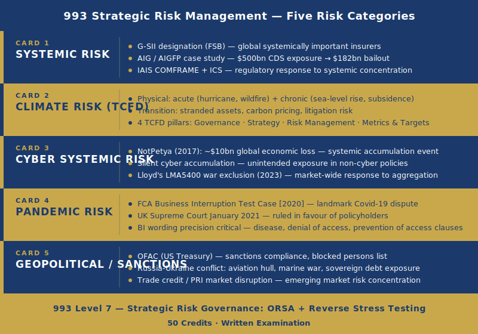

# 993 Assignment Help — Advances in Strategic Risk Management in Insurance (Level 7)

Unit 993 — Advances in Strategic Risk Management in Insurance is a 50-credit Level 7 written examination unit within the CII Advanced Diploma in Insurance. It is taken by Chief Risk Officers, senior risk managers, compliance directors, and Board-level risk professionals pursuing the ACII designation. The unit covers systemic risk in insurance and the AIG case study, climate risk through the TCFD framework, cyber as a systemic risk including NotPetya, pandemic and business interruption risk through the FCA BI Test Case, geopolitical and sanctions risk, and strategic risk governance at Board level. At Level 7, the exam does not test whether candidates can describe these risk categories — it requires candidates to analyse the governance implications of each, evaluate the adequacy of regulatory and market responses, and construct evidence-based arguments using specific case studies throughout. Every major risk area in 993 is examined through a case study lens: the AIG bailout, the NotPetya coverage disputes, the UK Supreme Court BI ruling, and the Russia-Ukraine sanctions response are not optional background — they are the primary evidence the exam expects.

---

## What Does 993 Cover? — The Syllabus at Level 7

Unit 993 is organised around five strategic risk categories, each examined through a specific case study or regulatory event. The unit also covers strategic risk governance — the ORSA at Board level and reverse stress testing — and requires candidates to synthesise across risk categories to evaluate systemic exposure. The macro-context throughout is strategic risk governance, not specialist class-of-business risk management.

### Systemic Risk in Insurance — G-SIIs and the AIG Lesson

The AIG case study remains the defining example of systemic risk in insurance, and 993 requires deep analytical engagement with it — not a summary.

AIG Financial Products (AIGFP) wrote over $500 billion in notional value of credit default swaps (CDS) and financial guarantee products through the early 2000s. CDS are instruments that pay out when a referenced debt instrument defaults — AIGFP effectively sold insurance protection to financial institutions holding mortgage-backed securities and other structured credit. When the US housing market collapsed in 2008, the value of those structured credit instruments fell dramatically, triggering margin calls on AIGFP's CDS positions. AIGFP could not meet those margin calls — the losses were not funded by insurance premium reserves, because CDS are not insurance products. The resulting liquidity crisis threatened AIG's entire insurance subsidiary network, which was financially sound and served millions of policyholders worldwide. The US government provided a $182 billion bailout to prevent AIG's collapse from propagating through the global financial system.

**The analytical lesson 993 requires**: AIG's traditional insurance operations were not systemically risky. It was AIGFP's non-traditional financial activities — capital markets activities grafted onto an insurance group structure — that created systemic contagion risk. Insurance risk (premium-funded, diversified across independent risks) does not inherently generate systemic risk; it is when insurance groups engage in financial intermediation activities that systemic interconnection is created. The 993 exam requires candidates to evaluate this distinction, not simply recount the AIG timeline.

**Regulatory response**: The Financial Stability Board (FSB) responded by designating G-SIIs (Global Systemically Important Insurers) — insurance groups posing systemic risk based on five criteria: size, global activity, interconnectedness with other financial institutions, substitutability (whether counterparties could easily replace the group's functions), and non-traditional insurance activity. G-SII designation subjects groups to enhanced supervisory requirements and higher capital standards. The IAIS developed COMFRAME (Common Framework for International Insurance Supervision) and the ICS (Insurance Capital Standard) — a global minimum capital standard for Internationally Active Insurance Groups (IAIGs). For 993, the evaluative question is whether the G-SII designation and ICS framework adequately address the systemic risk demonstrated by AIG, or whether the regulatory response focuses on size and activity metrics at the expense of addressing the non-traditional activity risk that actually caused the crisis.

### Climate Risk as Strategic Risk — The TCFD Framework

993 examines climate risk through the TCFD (Task Force on Climate-related Financial Disclosures) four-pillar framework, with specific physical and transition risk applications for insurers. The TCFD framework was developed by the FSB and has been adopted as mandatory disclosure regulation for premium-listed UK companies.

**Pillar 1 — Governance**: How the Board oversees climate risk — which committee has oversight responsibility (typically the Risk Committee), how frequently climate risk scenarios are reported to the Board, how climate expertise is assessed in the board skills matrix, and how Board-level challenge of climate risk management is evidenced.

**Pillar 2 — Strategy**: Climate scenario analysis using IPCC pathways — 1.5°C, 2°C, and 4°C warming trajectories — and their implications for underwriting strategy and financial planning. A 993 answer on strategy must specify what each pathway implies for the insurer's underwriting book (catastrophe loss frequency, geographic exposure), investment portfolio (stranded asset risk), and capital planning over short (up to 2 years), medium (2–10 years), and long-term (10+ year) horizons.

**Pillar 3 — Risk Management**: Integration of climate risk into the enterprise risk management (ERM) framework. Physical risk divides into:

- **Acute physical risk**: Increased frequency and severity of discrete weather events. For insurers: Atlantic hurricane intensification (Category 5 events becoming more frequent), Western US and Southern European wildfire frequency increase, UK surface water flood frequency increase from higher rainfall intensity. These events directly affect the underwriting book's loss models — cat models must be recalibrated to reflect forward-looking climate trajectories, not historical loss data alone.
- **Chronic physical risk**: Long-term structural environmental changes. Sea level rise creates long-term structural change to coastal property underwriting assumptions — properties insurable today may become uninsurable or unaffordable to insure within 20–30 years. Temperature increase affects crop insurance, health insurance, and long-tail liability exposures.

**Transition risk**: The risks associated with the economy transitioning away from fossil fuels. For insurers, transition risk operates through two channels: (1) **Stranded asset risk** — insurers who continue to underwrite coal mining operations or hold coal-related equities face the risk that those assets become worthless faster than assumed as regulatory and market pressure accelerates fossil fuel exit. (2) **Litigation risk** — insurers have been sued in multiple jurisdictions for continuing to provide insurance coverage for fossil fuel producers despite warnings that climate harm was foreseeable; the climate attribution litigation trend is creating direct underwriting liability exposure for insurers in the fossil fuel energy sector.

**Pillar 4 — Metrics and Targets**: GHG emissions disclosure — scope 1 (direct), scope 2 (purchased energy), and scope 3 (value chain) — physical risk metrics including PML adjusted for climate trajectory, and transition risk metrics including coal and oil exposure in the investment portfolio and underwriting book.

**The insurance protection gap**: Economic losses from natural catastrophes globally exceed insured losses by a factor of approximately 2:1 to 3:1. 993 requires analysis of how insurers can address uninsured exposure — through parametric products, public-private partnership schemes, or index-based products — while managing accumulation risk and avoiding cross-subsidisation between policyholders in different risk zones.

### Cyber as Systemic Risk — NotPetya, War Exclusions, and Accumulation

The NotPetya incident (June 2017) is the primary 993 case study for cyber systemic risk, and the exam expects detailed engagement with it.

NotPetya was Russian state-sponsored malware initially deployed against Ukrainian infrastructure but engineered to propagate globally via supply chains. The malware spread through software update mechanisms, infecting organisations with no direct connection to Ukraine: Maersk (global shipping — 45,000 PCs wiped, operational systems offline for 10 days), Merck (US pharmaceutical company — manufacturing and distribution systems destroyed), Mondelez International (food conglomerate), and FedEx/TNT (logistics). Estimated total global economic loss: approximately $10 billion.

**The insurance coverage dispute**: Merck held all-risk property damage policies that covered business interruption losses. Merck's insurers denied the claim, citing the war exclusion — a standard policy exclusion for losses arising from warlike action by a foreign government or sovereign power. The argument: NotPetya was a Russian state-sponsored attack, therefore it constituted warlike action.

**Merck v ACE Insurance Company (New Jersey Superior Court, 2023)**: The court found the war exclusion did not apply because the all-risk property policy did not clearly exclude cyber attacks by nation-states. The exclusion was drafted for physical kinetic warfare; its application to a cyber attack was ambiguous. The court held that ambiguity in insurance policy language is construed against the insurer. Merck recovered approximately $1.4 billion.

**Lloyd's LMA5400 war exclusion for state-sponsored cyber**: In response to the coverage uncertainty exposed by NotPetya and similar disputes, Lloyd's mandated that from 1 April 2023, all Lloyd's syndicates writing cyber insurance must use updated war exclusion language (LMA5400 or equivalent) that clearly excludes losses arising from state-sponsored cyber operations. The LMA5400 language specifies that attribution of a cyber attack to a state actor triggers the exclusion — addressing the ambiguity that allowed Merck to recover.

**Cyber accumulation as systemic risk**: The core 993 analytical issue is not individual cyber claims — it is accumulation. A single cyber event (a major cloud provider outage, a ransomware variant propagating through a shared software platform, or a critical infrastructure attack affecting multiple industries simultaneously) can generate correlated losses across hundreds or thousands of policyholders simultaneously. Traditional per-risk reinsurance structures, designed for independent risks, do not adequately address correlated cyber accumulation. Silent cyber — cyber losses arising from non-cyber policies (property, liability, marine) — compounds the problem: insurers may have accumulated cyber exposure they have not quantified because it sits within non-cyber policy portfolios.

### Pandemic Risk and the FCA Business Interruption Test Case

The FCA Business Interruption (BI) Test Case [2020] is the defining pandemic risk case study for 993, and the UK Supreme Court ruling in January 2021 must be understood at clause-specific level.

The FCA brought proceedings on behalf of SME policyholders whose BI claims were denied during the COVID-19 pandemic. Eight insurers were represented in the test case, each with a representative set of policy wordings. The issues tested were how standard BI clause types responded to pandemic-related business interruption — not whether pandemic cover was desirable, but whether existing wordings had unexpectedly triggered.

**Notifiable disease clauses**: These clauses respond when a notifiable disease occurs "within a specified radius of the insured premises." Insurers argued: (1) COVID-19 did not occur specifically within the radius of each insured's premises (it was a national pandemic); (2) even if it did occur within the radius, it was not COVID-19 specifically at the premises that caused the business interruption — the government imposed restrictions nationally regardless of local disease presence. The Supreme Court rejected both arguments. On the first: COVID-19 was present throughout the UK by the relevant date, including within any specified radius. On the second: the "but for" causation test — "but for COVID-19 at the specific premises, the business would have continued" — was not the correct causation analysis for an event of national coverage. The Court applied a trends clause analysis and concurrent cause analysis to reach the conclusion that the clause triggered.

**Denial of access clauses**: These respond to "government or local authority action preventing or hindering access to the premises." Insurers argued government guidance (rather than legally enforceable orders) did not constitute "action." The Court held that government guidance, while not legally enforceable in the criminal law sense, constituted action that "prevented or hindered" access for purposes of these clauses — because businesses that failed to follow the guidance faced regulatory and reputational consequences.

**Orient Express Hotels v Generali [2010]**: This pre-test-case authority had established a "but for" causation approach for BI claims — if the business interruption would have occurred anyway due to a wider catastrophe (in Orient Express, Hurricane Katrina damaged an entire region, not just the insured hotel), the BI cover did not respond. The Supreme Court in the FCA Test Case effectively distinguished Orient Express as limited to its specific facts and declined to apply the "but for" test to the pandemic context.

**Lessons for strategic risk management**: The BI Test Case demonstrates that systemic risk can trigger unexpected claims from dormant policy provisions — insurers had not intentionally provided pandemic BI cover, but the wording created an unintended exposure when tested. For 993, this illustrates the importance of wording precision as a risk management tool, the need to model non-damage BI exposures, and the systemic character of pandemic risk: a single event simultaneously activates thousands of policy provisions across an entire market.

---

## Geopolitical and Sanctions Risk — OFAC, Russia-Ukraine, and Aviation Hull

Geopolitical risk has re-entered the strategic risk agenda for insurers following the Russia-Ukraine war (from February 2022) and the sanctions response it triggered.

**OFAC (US Treasury Office of Foreign Assets Control)**: OFAC imposes US economic sanctions programmes that apply extraterritorially — non-US companies that provide services benefiting a sanctioned party may commit US sanctions violations even if the transaction is conducted entirely outside the US. For London market insurers: any insurance or reinsurance policy that provides cover to a sanctioned entity, in respect of sanctioned goods or vessels, or that pays a claim to a sanctioned counterparty, creates OFAC exposure. The practical implication is that London market insurers and reinsurers must conduct sanctions screening on cedants, insureds, and loss payees on every risk that has a US nexus (which includes most large commercial risks given the ubiquity of USD-denominated transactions).

**Russia-Ukraine war — aviation hull stranded aircraft**: When Western governments imposed sanctions on Russia in February-March 2022, aircraft leased to Russian airlines by Western lessors were stranded in Russia. The lessors — operating companies that own aircraft and lease them to airlines worldwide — held aviation hull insurance policies. The insurers' position: the war and confiscation exclusions in the hull policies applied because Russia was effectively confiscating the aircraft. The lessors' position: the insurance covered the physical loss of the aircraft regardless of the cause. The disputes — involving estimated claims of $7–10 billion for approximately 500 aircraft — resulted in major litigation across multiple jurisdictions between lessors and their hull and war risk underwriters.

**Trade credit and political risk following sanctions events**: Political risk insurance covers expropriation, political violence, currency inconvertibility, and contract frustration by a host government. The Russia-Ukraine context tested many of these covers simultaneously — Russian government refusal to permit aircraft export combined with currency inconvertibility (ruble convertibility restricted) and contract frustration (lease agreements rendered unperformable by sanctions). For 993, the evaluative issue is how political risk insurers assess and price sovereign risk exposure in an environment where geopolitical events can move rapidly from chronic risk to acute event.

---

## Strategic Risk Governance — ORSA and Reverse Stress Testing

### ORSA at Strategic Level

The Own Risk and Solvency Assessment (ORSA) at strategic level is not a regulatory compliance exercise — it is the Board's tool for genuinely assessing whether the firm's capital and risk management are adequate for its actual risk profile. The distinction the 993 exam draws is between an ORSA produced by the risk management function and rubber-stamped by the Board (a compliance exercise) and an ORSA that the Board actively challenges, stress-tests, and uses to drive strategic capital allocation decisions (a genuine governance tool).

At strategic level, the ORSA must incorporate the emerging risks covered in 993 — climate scenario analysis under TCFD, cyber accumulation modelling, pandemic exposure assessment — not merely the standard SCR formula risks. A Board that accepts an ORSA which does not address climate transition risk, cyber accumulation, or pandemic BI exposure against current market reality is not discharging its ORSA obligation genuinely.

### Reverse Stress Testing

Reverse stress testing is a governance tool that works backwards from failure: identify the scenarios that would render the business model unviable, then assess the probability of those scenarios and the adequacy of controls to prevent or mitigate them. For 993, the exam expects candidates to construct specific reverse stress test scenarios from the risk categories examined:

- **Systemic cyber event**: A cloud provider outage or ransomware variant simultaneously affecting 30% of the UK SME insured base — generating BI and cyber claims totalling three times the insurer's cyber CAT budget
- **Pandemic BI accumulation**: A second pandemic event where BI wordings drafted post-COVID-19 still contain non-damage trigger exposure — activating claims across an entire commercial lines portfolio
- **Climate accumulation loss**: A confluence of UK flooding, European windstorm, and US hurricane in a single underwriting year — combined losses exceeding the insurer's aggregate catastrophe PML at the 1-in-200 level across multiple peril zones simultaneously

The governance value of reverse stress testing is not the scenarios themselves — it is the board conversation they generate about which risks the firm is actually prepared for and which it assumes are low-probability without genuine analysis.

---

## How Is 993 Assessed?

Unit 993 is assessed by written examination at Level 7 — 50 credits, academic analytical standard. The exam tests the candidate's ability to apply strategic risk governance frameworks to specific case study evidence and construct justified analytical conclusions.

**Level 7 answer structure for 993**: (1) Identify the specific risk category and the case study context the question addresses. (2) State the relevant regulatory framework or analytical framework (G-SII designation criteria, TCFD four pillars, LMA5400 war exclusion logic, FCA BI Test Case clause analysis). (3) Apply the framework analytically to the scenario presented — do not describe what the framework is; apply it to evaluate the specific risk management question asked. (4) Use the case study evidence to support the argument: AIG, NotPetya, FCA BI Test Case, Russia aviation hull — these are the evidence sources the exam expects. (5) Reach a justified conclusion.

**Common Level 7 failures in 993**: Describing TCFD pillars without applying them to an insurer's specific strategic risk position. Recounting the AIG timeline without analysing why non-traditional activity creates systemic risk while traditional insurance does not. Listing cyber risk types without evaluating the accumulation problem or the war exclusion dispute implications. At Level 7, knowledge display without analytical application does not demonstrate the required standard.

---

## How Does 993 Fit into the Advanced Diploma — and What Makes Level 7 Different?

Unit 993 operates at the intersection of regulatory frameworks (TCFD, G-SII, ORSA), market events (NotPetya, FCA BI Test Case, Russia sanctions), and strategic governance — a combination that reflects the actual risk management challenges facing CROs, Board Risk Committees, and Heads of Internal Audit in major insurers. At Level 7, the expectation is not that candidates know more than at Level 4 or Level 6 — it is that they think differently: using evidence to construct arguments, evaluating adequacy not just describing structure, and reaching conclusions under analytical uncertainty.

---

> **Get Expert Help with Your 993 Risk Management Exam**
>
> Our 993 support team includes CRO-level specialists with Level 7 academic writing capability. We provide case study application coaching, TCFD and systemic risk analytical framing, and written exam practice calibrated to the 50-credit Level 7 standard.
>
> [Contact us] | Reply within 24 hours

---

## 993 in the CII Advanced Diploma Pathway

Unit 993 is a Level 7, 50-credit optional unit within the CII Advanced Diploma in Insurance. Alongside a 30-credit core unit such as 820 (Advanced Claims) or 960 (Advanced Underwriting), it provides substantial credit toward the ACII designation. It pairs particularly well with [990 insurance corporate management assignment help](/990-assignment-help) for candidates working in risk, governance, or C-suite roles — the ORSA governance obligations in 990 connect directly to the strategic ORSA and reverse stress testing analysis that 993 requires.

For the full Advanced Diploma pathway, see [CII Advanced Diploma in Insurance assignment help](/cii-advanced-diploma-assignment-help).

---

## Frequently Asked Questions about 993

**Q1: How hard is 993?**

Unit 993 is among the hardest CII units because it combines content that evolves rapidly — climate risk regulation, cyber coverage disputes, sanctions developments — with the Level 7 requirement for academic analytical writing. Candidates who work in risk management often know the content thoroughly but need support structuring evidence-based arguments and applying analytical frameworks (TCFD, FSB G-SII methodology, BI test case clause analysis) to insurance scenarios under exam conditions. The 50-credit weight means the examination is substantially longer than standard units and requires depth across all five major risk categories.

**Q2: What is the FCA Business Interruption Test Case and why does it matter for 993?**

The FCA BI Test Case [2020] was a UK Supreme Court ruling (January 2021) that many standard BI policy wordings — notifiable disease clauses, denial of access clauses, and prevention of access clauses — did respond to COVID-19-related business interruption losses, contrary to the initial position taken by eight named insurers. The ruling established important precedents about causation analysis for systemic events, the scope of "action" by a government authority, and the limits of the "but for" causation test in pandemic contexts. For 993, it is the primary case study for pandemic risk management and for the proposition that systemic risk can activate unexpected claims from policy provisions that were not modelled as exposed.

**Q3: What is a G-SII and why is the designation significant for 993?**

A Global Systemically Important Insurer is an insurance group designated by the FSB as posing systemic risk to the global financial system based on five criteria: size, global activity, interconnectedness, substitutability, and non-traditional insurance activity. AIG's 2008 near-collapse was the catalyst for G-SII designation. For 993, the significant analytical issue is not the designation criteria — it is the evaluative question of whether the G-SII framework and ICS (Insurance Capital Standard) adequately address the actual source of systemic risk that AIG demonstrated, which was non-traditional financial activity rather than traditional insurance operations.

**Q4: How is climate risk treated in 993?**

Unit 993 treats climate risk through the TCFD four-pillar framework — Governance, Strategy, Risk Management, and Metrics and Targets — applied specifically to the insurance context. Physical risk (acute events including hurricanes and wildfires, and chronic changes including sea level rise) affects underwriting loss models and capital requirements. Transition risk (stranded assets from coal and fossil fuel underwriting, and climate attribution litigation) affects both the investment portfolio and underwriting strategy. The 993 exam requires candidates to evaluate how insurers are responding to climate risk strategically — constructing an argument about adequacy, not describing what TCFD is.

**Q5: Can I study 993 without a risk management background?**

Unit 993 is accessible to candidates from various insurance backgrounds — underwriting, claims, broking — but the content is advanced and fast-moving. The systemic risk, TCFD, cyber risk, and sanctions sections are covered in the CII study texts; the analytical depth required at Level 7 is what candidates from non-risk backgrounds find most challenging. Structured preparation support that focuses specifically on analytical argument construction — using the AIG, NotPetya, and BI Test Case evidence to build and support arguments — is the most effective approach for candidates without a dedicated risk management background.
