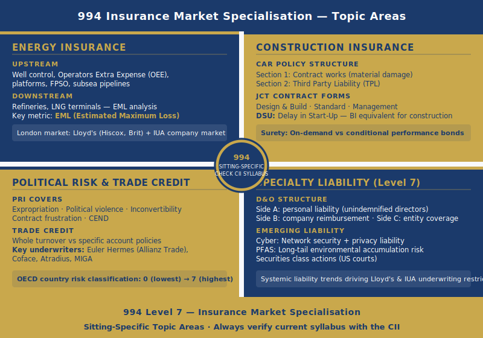

# 994 Assignment Help — Insurance Market Specialisation | CII Advanced Diploma Level 7

Unit 994 — Insurance Market Specialisation is a 50-credit Level 7 written examination unit within the CII Advanced Diploma in Insurance. A critical characteristic of 994 that candidates must know immediately: the specific subject area examined in 994 varies by examination sitting. The CII announces the topic for each 994 sitting several months before the examination date — candidates must check the CII website under the 994 unit listing for their specific sitting before commencing detailed preparation. This page covers the main specialist market areas that have been and can be examined — energy (upstream and downstream), construction (CAR, JCT, DSU), political risk and trade credit, and specialty liability (D&O, cyber, PFAS) — each at the depth Level 7 requires. The unit is taken by insurance professionals working in specialist markets who are pursuing the ACII designation; the exam requires not just technical knowledge of the specialist market but strategic analysis of its structures, pricing, capacity dynamics, and emerging issues.

---

## What Does 994 Cover? — Understanding the Sitting-Specific Structure

Unit 994's sitting-specific nature is not a minor administrative detail — it is the defining feature of how candidates must prepare. Unlike 991 or 993 where the syllabus is fixed, a 994 candidate sitting in one period may face an energy insurance examination while a candidate in the next period faces a construction or political risk examination. The CII's publication of the topic in advance gives candidates a defined target, but it also means that preparation must be focused on the announced topic rather than spread across all areas.

What all 994 topics have in common regardless of the specific sitting subject: (1) Level 7 analytical standard — specialist technical knowledge is the foundation, not the destination; (2) global market context — the exam expects knowledge of which markets lead the class, who the major underwriters are, and how capacity and pricing behave across the cycle; (3) emerging issues — each specialist market has current developments (climate risk, sanctions, coverage disputes, digital disruption) that Level 7 answers must address; (4) analytical structure — comparing approaches, evaluating tradeoffs, and reaching justified conclusions rather than listing product features.

---

> **Important: Confirm your 994 sitting topic with the CII before beginning detailed preparation. The topic changes by examination period. Contact us once you have confirmed your topic and we will match you with a specialist for that specific area.**

---

## Energy Insurance in 994 — Upstream and Downstream at Level 7

Energy insurance is among the most technically complex specialist classes in the London market and one of the most frequently examined 994 topics. The London market — Lloyd's syndicates and IUA company market members — is the global centre for energy insurance, handling risks that domestic markets in producing countries cannot absorb.

### Upstream Energy Insurance — Exploration, Production, and Offshore

Upstream energy covers risks associated with oil and gas exploration and production (E&P) activities. The policy structure addresses both the physical assets and the consequential costs of incidents.

**Key coverage sections in upstream energy policies**:

| Coverage Section | What It Covers | Key Underwriting Trigger |
|---|---|---|
| Well control / blowout | Costs of regaining control of a runaway well — well-killing costs, re-drilling costs, seepage, pollution | Loss of well control event |
| Operator's Extra Expense (OEE) | Consequential costs of a well control incident including loss of production income, third-party well control contractor costs | Well control event with extended remediation |
| Physical damage — offshore | Platforms, FPSO vessels, subsea equipment, pipelines — material damage on an all-risks basis | Physical loss or damage from any cause not excluded |
| Offshore liability | Third-party liability for bodily injury, property damage, and pollution arising from offshore operations | Third-party claim or statutory liability |

**Key underwriting factors**: Well type (exploration well — higher risk than development well on a proven reservoir), reservoir depth and pressure (higher pressure = higher blowout risk), operator experience and track record (major IOC vs independent E&P company), age and maintenance standard of offshore installation (asset values, inspection records), geographic location (Gulf of Mexico — US OPA '90 unlimited liability for spills; North Sea — OPOL and OSPAR environmental framework; West Africa — weaker regulatory oversight, higher political risk).

**EML for offshore installations**: Estimated Maximum Loss for a major FPSO or offshore platform can reach $1 billion or more for the largest and most complex installations. London market capacity — from Lloyd's syndicates (Hiscox, Brit, CV Starr) and IUA company market members — is essential for providing the capacity required at these values.

**Oil Pollution Act 1990 (US OPA '90)**: For US-waters offshore operations, OPA '90 imposes unlimited liability on responsible parties for oil spills — unlimited in the sense that there is no cap on natural resources damages, removal costs, or third-party economic losses. This is a major underwriting consideration for Gulf of Mexico operations; the Deepwater Horizon (2010) claims illustrated the scale of OPA '90 exposure.

### Downstream Energy Insurance — Refineries and Processing Plants

Downstream energy covers petrochemical refineries, LNG liquefaction and regasification terminals, oil refineries, and gas processing facilities — high-value, concentrated, and highly hazardous assets.

**Policy structure**: Material damage (all-risk or named perils on plant and machinery, buildings, and stock — given the catastrophic fire and explosion potential, named perils coverage is less common for downstream because the range of relevant perils is broad) and business interruption (indemnity period often 24–36 months given the extreme complexity and time required to reconstruct or repair damaged refinery process units).

**EML analysis as the core underwriting tool**: The Estimated Maximum Loss is the maximum foreseeable loss from a single event at the facility — typically a major fire or explosion at the highest-value process unit. EML calculation for a downstream facility requires:

- Process hazard analysis (identifying which process units contain the highest hazard — typically crude distillation units, catalytic crackers, or gas separation units given their high-energy process conditions)
- Fire and explosion modelling (blast overpressure radius, radiant heat flux modelling)
- Assessment of separation between high-value process units (physical distance and fire barriers — single-risk limits are set based on EML, not total insured value)
- Fire protection quality (suppression systems, detection, water supply and deluge capacity)

A downstream facility with a Total Insured Value of $3 billion may have an EML of $500 million if process units are adequately separated and fire protection is first-class — or an EML of $1.5 billion if process units are closely packed with inadequate fire separation. The EML drives the per-risk capacity required from the market and the premium level.

**DSU (Delay in Start-Up)** for downstream: where a refinery or processing facility is undergoing major capital investment (expansion or reconstruction), DSU provides cover for the financial losses resulting from delays to start-up caused by insured material damage events during construction. The indemnity period and maximum indemnity period in DSU policies for major downstream projects are typically longer than for construction projects generally, reflecting the complexity and the revenue at stake.

---

## Construction Insurance in 994 — CAR Structure, JCT Forms, and DSU

Construction insurance is a major specialty market topic that tests candidates' understanding of how risk is allocated across a construction project — between employer, contractor, and insurer — and how that allocation changes depending on which JCT contract form is used.

### CAR Policy Structure and JCT Contract Forms

**Contractors' All Risks (CAR) policy structure**: The standard CAR policy is structured as follows:

| Section | Coverage | Sum Insured |
|---|---|---|
| Section 1 — Contract Works | Material damage to the works being constructed — all-risk basis | Contract value (increases as works progress) |
| Section 2 — Third Party Liability | Injury to third parties or damage to their property caused by contract operations | Policy limit (separate from Section 1) |
| Section 3 — Employer's Liability (optional) | Employer's liability for injury to the contractor's own employees | Statutory minimum or higher |

The policy period runs from commencement of works through practical completion to the end of the defects liability period (typically 12 months post-completion). During the defects liability period, the contractor is responsible for rectifying defects — the CAR policy maintains cover for the risk of an insured event during this period.

**JCT contract forms and risk allocation**: The Joint Contracts Tribunal (JCT) publishes standard building contract forms that allocate risk between employer and contractor. The choice of JCT form determines who bears construction risk and therefore who should be the named insured on the CAR policy.

| JCT Form | Design Responsibility | Construction Risk | CAR Named Insured |
|---|---|---|---|
| JCT Design and Build (D&B) | Contractor designs and builds | Contractor bears design and construction risk | Contractor typically arranges; employer may require joint names |
| JCT Standard Building Contract | Employer retains design; contractor builds to employer's design | Contractor bears construction risk; employer bears design risk | Joint-name policy common (protects both parties' interests) |
| JCT Management Contract | Employer retains design; management contractor co-ordinates works contractors | Risk allocation is complex — management contractor has limited direct construction risk | Employer often arranges to protect the whole project |

The 994 exam at Level 7 requires candidates to evaluate the implications of the JCT form choice for insurance structuring — not simply describe what each form involves. A joint-name CAR policy protects both employer and contractor; a contractor-arranged policy may leave the employer without direct insurer recourse if the contractor becomes insolvent.

**Performance bonds and surety**: A performance bond is a guarantee issued by a surety (typically a bank or specialist surety company) on behalf of a contractor, guaranteeing completion of the contract if the contractor defaults. The distinction between an on-demand bond (payable on demand by the employer, without proof of loss) and a conditional bond (payable only if the employer can prove the contractor's default and quantify the loss) is a Level 7 analytical issue — on-demand bonds are more valuable to employers but more expensive for contractors to obtain, which affects project tendering.

### DSU — Delay in Start-Up Insurance

DSU (Delay in Start-Up) insurance is the construction-phase equivalent of Business Interruption. It covers financial losses resulting from a delay to the start of commercial operations caused by an insured event under the contract works (Section 1 material damage) section.

**Covered losses under DSU**: Anticipated revenue loss during the delay period (revenue the project would have generated from its original target start date), additional financing costs (interest on construction loans continuing during the delay), and fixed overhead and operating costs that cannot be avoided during the delay. DSU does not cover delays caused by construction deficiencies, design errors, or contractor performance failures — only delays caused by an insured material damage event.

**Indemnity period and maximum indemnity period**: The indemnity period begins from the original target start-up date and runs for the actual delay period, subject to the maximum indemnity period stated in the policy. For a major infrastructure project, the maximum indemnity period may be 18–36 months. The maximum indemnity period is an underwriting key consideration — a longer period increases the insurer's exposure significantly.

**Underwriting key factors for DSU**: Total project value, construction timeline, revenue projections from the completed facility, construction risk quality (contractor experience, design complexity, procurement strategy), and maximum indemnity period. DSU underwriters must assess whether the delay risk is adequately reflected in the premium — a project with a complex critical path and a tight revenue start date has higher DSU risk than a simple project with buffer time built into the programme.

---

## Political Risk and Trade Credit Insurance in 994

### Political Risk Insurance (PRI)

Political risk insurance covers investors, exporters, and lenders against losses arising from sovereign or governmental actions affecting their overseas investments or transactions.

**Key PRI coverage types**:

| Coverage | Definition | Key Trigger |
|---|---|---|
| Expropriation | Government confiscation or nationalisation of assets without adequate compensation | Government action that deprives investor of economic benefit of the investment |
| Political violence | War, terrorism, civil commotion, revolution — causing physical damage or business disruption | Political violence event affecting the insured's assets |
| Currency inconvertibility | Government restrictions preventing conversion and repatriation of profits or capital | Host government action blocking currency transfer |
| Contract frustration | Host government failure to honour contractual obligations — government as a commercial counterparty | Government repudiation or frustration of a contract |

**Key PRI underwriters**: Lloyd's political risk market (Hiscox, Beazley, Chaucer), MIGA (World Bank's Multilateral Investment Guarantee Agency — development-finance focused), US EXIM Bank, Euler Hermes (now Allianz Trade), and Coface. The London private market and multilateral institutions operate in parallel — MIGA takes longer-term and lower-premium risks that the private market prices out; the London market takes the more commercially priced, complex risks.

**Country risk rating**: The OECD country risk classification runs from 0 (lowest risk — OECD high-income economies) to 7 (highest risk — severely indebted or politically unstable economies). The PRI underwriter uses the OECD classification as a starting point but applies qualitative judgement — political change, regulatory track record, judicial independence, and sector-specific nationalisation history are all relevant underwriting factors beyond the OECD score.

### Trade Credit Insurance

Trade credit insurance covers sellers of goods and services against buyers' failure to pay for goods or services delivered on credit. It is a volume-driven market — major underwriters (Euler Hermes/Allianz Trade, Coface, Atradius) cover billions of euros of trade receivables across millions of transactions globally.

**Key policy structures for 994**:

| Structure | Coverage Scope | Premium Basis |
|---|---|---|
| Whole turnover | All buyers in the insured's debtor book above a minimum turnover level | Percentage of turnover |
| Specific account | Single named buyer | Flat premium or rate on line of credit |

**Credit limit**: The maximum exposure per buyer that the insurer will cover — set by the insurer based on the buyer's financial strength, credit history, and sector risk. If the insurer declines to set a credit limit for a specific buyer (or reduces an existing limit), the policyholder is no longer covered for that buyer — this can affect the policyholder's willingness to continue trading on credit terms with that buyer.

**Protracted default**: A buyer fails to pay within an agreed waiting period — typically 90–180 days beyond the payment due date — without becoming formally insolvent. Protracted default cover activates when the waiting period expires; the policyholder does not need to wait for formal insolvency proceedings to claim.

---

## Specialty Liability at Level 7 — D&O, Cyber Liability, and PFAS

### D&O Insurance — Side A, B, and C at 994 Depth

Directors and Officers (D&O) insurance protects the personal assets of directors and officers of companies against claims arising from their management decisions. At Level 7, 994 requires understanding of the three-sided structure of D&O policies.

| Side | Insures | Key Coverage Trigger |
|---|---|---|
| Side A | Personal assets of directors and officers — where the company does not (or cannot) indemnify them | Personal liability for wrongful acts; company indemnification is unavailable (company insolvent, or indemnification legally prohibited) |
| Side B | The company — reimbursement of the company when it has indemnified directors or officers for covered claims | Company has paid D&O claim on behalf of the director/officer |
| Side C | The company entity — securities claims against the company itself (entity coverage) | Securities class action or regulatory investigation naming the company |

**Securities class actions**: The largest D&O claims globally are US securities class actions — brought against companies (and their directors) listed on US exchanges or with US investors, alleging that share price declines resulted from misrepresentation or omission in company disclosures. US class actions can generate claims measured in hundreds of millions of dollars; the US litigation environment (discovery obligations, jury trials, contingency fee plaintiffs' lawyers) drives both frequency and severity. D&O underwriters assess US securities exposure as a primary rating factor.

### Cyber Liability at 994 Depth

Cyber liability insurance covers losses arising from cyber events — data breaches, ransomware attacks, network outages, and third-party claims arising from the insured's failure to protect data. At Level 7, 994 requires analysis of the coverage structure and its emerging challenges.

**Key cyber liability coverage components**: Network security liability (third-party claims from individuals whose data was compromised), privacy liability (regulatory fines and penalties from data protection authorities — ICO GDPR fines, FTC enforcement in the US), crisis management costs (forensic investigation, notification costs, public relations), and first-party business interruption (loss of income from the insured's own network outage).

**Cyber accumulation challenge** (connecting to 993): Cyber liability underwriters face the same systemic accumulation issue discussed in unit 993 — a single cyber event can simultaneously trigger claims across an entire portfolio. Pricing adequacy for cyber is a current market challenge: the rapid escalation of ransomware frequency in 2020–2022 led to significant market hardening; underwriters are now wrestling with how to model tail risk events (systemic cloud outage, critical infrastructure attack) that have no historical loss data.

### PFAS — Emerging Long-Tail Accumulation

Per- and Polyfluoroalkyl Substances (PFAS) — "forever chemicals" — represent a major emerging long-tail liability accumulation issue for specialty liability markets. PFAS have been used in thousands of industrial and consumer products since the 1950s; they are extremely persistent in the environment and have been linked to adverse health effects. US litigation against PFAS manufacturers and users has been generating claims comparable in scale to asbestos litigation, raising questions about historic general liability and pollution policy exposure for decades of prior underwriting. For 994, PFAS represents an example of how environmental and health science can create retroactive underwriting exposures across multiple policy generations — a strategic risk management issue as much as a claims issue.

---

## How to Prepare for 994 When the Sitting Topic Varies

The sitting-specific nature of 994 requires a different preparation approach from most CII Advanced Diploma units. Candidates should follow this preparation strategy:

**Step 1 — Confirm your sitting topic**: The CII publishes the 994 topic for each examination period on the CII website under the 994 unit listing, typically several months before the sitting. Do not begin specialist market preparation until you have confirmed your topic.

**Step 2 — Acquire topic-specific technical knowledge**: The CII publishes study materials for the announced topic. Supplement this with market-specific sources — Lloyd's market reports, IUA statistics, Lloyd's and IUA market bulletins for the relevant class.

**Step 3 — Identify the current emerging issues for the topic**: Every 994 topic has current market issues that Level 7 answers must address. For energy: transition risk, the energy insurance market response to the energy transition, offshore wind. For construction: supply chain risk, contractor insolvency, smart contracts. For political risk: sanctions developments, ESG and emerging market investment risk. For specialty liability: PFAS accumulation, D&O for ESG claims, cyber pricing cycle.

**Step 4 — Practise Level 7 analytical structure applied to the topic**: Technical knowledge of the specialist market is the foundation; the Level 7 analytical task — constructing arguments, evaluating tradeoffs, reaching justified conclusions — is what turns that knowledge into an examination performance.

Our support service is available for any 994 specialist market topic. Contact us once you have confirmed your sitting topic and we will match you with a specialist for that specific area.

---

## How Is 994 Assessed?

Unit 994 is assessed by written examination at Level 7 — 50 credits. The examination tests specialist market technical knowledge applied at academic analytical standard. A Level 7 994 answer structure: (1) Define key concepts with technical precision — not generic insurance definitions, but specialist market definitions with correct technical values (EML, OEE, DSU indemnity period, D&O Side A). (2) Compare structures or approaches — not just describe options. (3) Evaluate advantages and limitations in the context of the specific market dynamics, current pricing cycle, and emerging issues. (4) Reference current market developments or case studies that demonstrate live analytical engagement with the specialist area. (5) Reach a clear conclusion that follows from the analysis.

**Common Level 7 failures in 994**: Describing what a CAR policy covers without evaluating the risk allocation implications of different JCT contract forms. Explaining what upstream energy covers without analysing the EML methodology or the OPA '90 liability framework. Listing D&O Side A, B, and C without evaluating how the three sides interact in an insolvency scenario where Side A coverage is most critical. At Level 7, description of product features does not demonstrate the analytical standard required.

---

## How Does 994 Fit into the CII Advanced Diploma?

Unit 994 sits alongside [993 strategic risk management assignment help](/993-assignment-help) and [991 London market specialisation assignment help](/991-assignment-help) as a Level 7, 50-credit optional unit within the CII Advanced Diploma in Insurance. Candidates in specialist market roles — energy underwriters, construction underwriters, political risk brokers, specialty liability practitioners — find 994 the most directly relevant Advanced Diploma optional unit for their professional context. Combined with a 30-credit core unit such as [960 advanced underwriting assignment help](/960-assignment-help), 994 provides substantial credit contribution to ACII eligibility from two units.

For the full Advanced Diploma pathway context, see [CII Advanced Diploma in Insurance assignment help](/cii-advanced-diploma-assignment-help).

---

> **Get Expert Help with Your 994 Exam — Any Specialist Topic**
>
> Our 994 support team covers all specialist market topics — energy, construction, political risk, trade credit, specialty liability, marine, and aviation. Tell us your sitting's confirmed topic and we will match you with the right specialist.
>
> [Contact us] | Reply within 24 hours

---

## 994 in the CII Advanced Diploma Pathway

Unit 994 is a Level 7, 50-credit optional unit in the CII Advanced Diploma. Its sitting-specific structure means preparation is highly focused — candidates commit to one specialist market area rather than surveying the full range. This focus also means that a candidate with deep expertise in, for example, energy underwriting has a significant advantage when the energy topic is announced — expertise becomes directly examinable at Level 7 depth.

For candidates seeking [993 strategic risk management assignment help](/993-assignment-help) or [991 London market specialisation assignment help](/991-assignment-help) as alternative Level 7 optional units, see those pages for a comparison of which unit best fits different professional backgrounds.

---

## Frequently Asked Questions about 994

**Q1: How do I know which specialist market 994 will cover in my sitting?**

The CII announces the 994 topic area for each examination sitting period several months in advance. Candidates should check the CII website under the 994 unit listing for their specific sitting. The topic is confirmed well enough in advance to allow focused preparation — do not assume continuity from one sitting period to the next, as the topic changes. Our support service is available for any specialist market topic; contact us once you have confirmed your sitting's announced topic.

**Q2: What are the most commonly examined 994 topics?**

Based on CII examination history, energy insurance (upstream and downstream), construction insurance, and political risk/trade credit have been among the most frequently examined topics for unit 994. However, specialty liability, marine, and aviation have also been examined in different sitting periods. The specific topic varies between sittings, so candidates must always verify directly with the CII for their specific examination period — never rely on assumptions based on previous sitting topics.

**Q3: How hard is 994?**

Unit 994 is among the hardest CII units for most candidates because it combines specialist technical knowledge — which is genuinely deep and not intuitively obvious to candidates without direct market experience — with Level 7 analytical writing requirements. Candidates working in the relevant specialist market have a significant content advantage but still need structured preparation to reach the academic analytical standard. Candidates from non-specialist backgrounds face the dual challenge of acquiring the technical knowledge and developing the analytical writing technique simultaneously.

**Q4: How should I structure a Level 7 994 answer?**

A 994 Level 7 answer requires: (1) precise definition of key specialist concepts with correct technical values (not paraphrased descriptions); (2) comparison of structures or approaches rather than listing them separately; (3) evaluation of advantages and limitations in the context of current market dynamics; (4) reference to current market developments, case studies, or regulatory changes demonstrating live engagement with the specialist area; and (5) a clear, reasoned conclusion. Answers that describe how a specialist insurance product works without analysing its market position, pricing challenges, capacity constraints, or strategic implications typically fall short of the Level 7 standard.

**Q5: Can I get help with 994 regardless of which topic my sitting covers?**

Yes. Our CII assignment help service covers all 994 specialist market topics — energy (upstream and downstream), construction (CAR, JCT, DSU, surety), political risk, trade credit, specialty liability (D&O, cyber), marine, and aviation. Once you have confirmed your sitting's topic with the CII, contact us with the specific focus area and we will match you with a specialist who has direct market expertise in that area for targeted Level 7 preparation.
