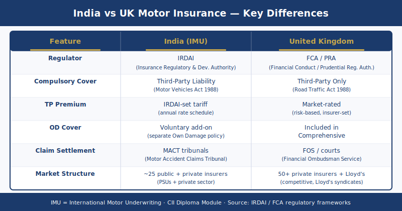

# IMU / IMP India Motor Insurance Assignment Help — CII Qualification

IMU (India Motor — Underwriting and Claims) and IMP (India Motor Products) are CII motor insurance units specifically designed for insurance professionals operating in the Indian market. Both units carry 15 credits at Level 3 and are assessed by a scenario-based multiple-choice question (MCQ) examination. They cover the IRDAI regulatory framework, the Motor Vehicles Act 1988 (India), Indian motor insurance cover types, Insured Declared Value calculation, No Claim Bonus mechanics, long-term motor policy requirements, Compulsory Personal Accident cover, and the Indian motor claims handling process including surveyor appointment and Motor Accident Claims Tribunal procedures. IMU and IMP replace the UK-specific content of IF5 with the Indian regulatory and market context — the Road Traffic Act 1988 (UK), the MIB, and MID references in IF5 do not apply; the Motor Vehicles Act 1988 (India), IRDAI circulars, and the Solatium Fund are the correct statutory and regulatory authorities. These units are taken by Indian insurance professionals pursuing CII qualification recognised by IRDAI-licensed insurers and intermediaries across India. This service provides structured IMU and IMP exam preparation support covering all syllabus areas with India-specific regulatory depth.

---

## IMU vs IMP — Understanding the Two Indian Motor Units

IMU and IMP address the same subject matter — Indian motor insurance — from two complementary angles. Most Indian CII students prepare for both units together, and this service provides assignment help for both.

**IMU (India Motor — Underwriting and Claims process)**: IMU focuses on how motor risks are underwritten and how motor claims are handled in the Indian market. Syllabus areas include: risk assessment at proposal stage, IRDAI compliance requirements in the underwriting process, proposal form evaluation, premium calculation including Own Damage rating factors, FNOL procedures under Indian insurer practice, surveyor appointment requirements under the Insurance Act 1938 as amended, and settlement procedures including Motor Accident Claims Tribunal (MACT) compensation principles.

**IMP (India Motor Products)**: IMP focuses on the structure and scope of motor insurance products available in the Indian market. Syllabus areas include: the third party liability (TPL) cover structure, the Own Damage (OD) section of a comprehensive policy, Insured Declared Value (IDV) calculation methodology, No Claim Bonus (NCB) scales and transfer rules, Compulsory Personal Accident (CPA) cover obligations, long-term motor policy structures mandated by IRDAI from 2018, and add-on covers available in the Indian market.

The process-versus-product distinction is directly tested in MCQ scenarios: a question asking how a surveyor should assess OD damage is an IMU topic; a question asking what the IDV is for a vehicle of a given age is an IMP topic. Understanding which unit owns which topic prevents candidates from confusing the two syllabus areas in the examination.

---

## IRDAI and the Indian Motor Insurance Regulatory Framework

IRDAI (Insurance Regulatory and Development Authority of India) is the statutory regulator for all insurance business in India — general insurance, life insurance, and health insurance. Understanding IRDAI's structure, powers, and specific role in motor insurance regulation is mandatory for both IMU and IMP examinations.

**Establishment**: IRDAI was established under the Insurance Regulatory and Development Authority Act 1999. It replaced the Controller of Insurance, who had regulated the Indian insurance market under the colonial-era Insurance Act 1938. The Insurance Act 1938 remains in force as the primary legislation governing insurance contracts and insurer obligations in India; IRDAI exercises its regulatory powers within that statutory framework and issues circulars, regulations, and guidelines that supplement it.

**IRDAI powers in motor insurance**: IRDAI sets the mandatory terms for compulsory Third Party (TP) motor cover — insurers cannot alter the TP cover scope or price it independently. IRDAI approves motor product wordings before they may be sold (under the Use and File or File and Use procedures). IRDAI sets solvency margin requirements for all general insurers, including motor insurers. IRDAI issues circulars that mandate structural changes to the motor insurance market — the long-term policy mandate (2018) and the CPA cover amount (2019) are both IRDAI circular-driven requirements.

**Premium regulation — the critical IMU/IMP exam distinction**:

| Cover Component | Premium Regulation Status |
|---|---|
| Third Party (TP) cover | IRDAI-regulated — premium rates set annually by IRDAI; insurers cannot compete on TP premium |
| Own Damage (OD) cover | Detariffed since 2007 — insurers set their own OD rates based on underwriting judgement |

Until 2007, both TP and OD premiums were set by the Tariff Advisory Committee (TAC) — insurers could not vary rates. In 2007, OD rates were detariffed — liberalised so that insurers could compete on OD pricing. TP rates remain fully regulated: all insurers charge the same TP premium for a given vehicle category, set annually by IRDAI. This dual regulation structure is one of the most frequently tested distinctions in IMU/IMP MCQ scenarios. A question asking whether an insurer can discount the TP premium to attract business requires the answer: no, TP rates are IRDAI-regulated and cannot be discounted.

**Product approval**: All motor insurance wordings and add-on covers must be filed with IRDAI before sale. IRDAI reviews filings for consumer protection compliance and product transparency. Insurers may not sell products that have not been approved through the applicable filing procedure.

---

## Motor Vehicles Act 1988 (India) — Compulsory Third Party Cover

The Motor Vehicles Act 1988 (India) is the primary legislation governing the use of motor vehicles on Indian roads and the compulsory insurance obligation that attaches to that use. It is the Indian equivalent of the UK's Road Traffic Act 1988, but the two statutes are entirely separate and their provisions differ.

**Motor Vehicles Act 1988 (India) s.146**: No person shall use a motor vehicle in a public place without a policy of insurance that at minimum covers:

- Death or bodily injury to any third party (unlimited liability for personal injury — there is no statutory cap on personal injury compensation under the Motor Vehicles Act);
- Damage to third party property (currently covered up to ₹7.5 lakh per incident, subject to IRDAI revision);
- Death or bodily injury of passengers if the vehicle is a public service vehicle (bus, taxi).

The unlimited personal injury liability under the Motor Vehicles Act is a critical exam distinction from the property damage cap. IF5 candidates familiar with the UK MIB framework must discard that structure when approaching IMU/IMP scenarios — there is no cap on TP personal injury liability in India.

**Motor Accident Claims Tribunal (MACT)**: Disputes arising from motor accident compensation claims in India are heard by Motor Accident Claims Tribunals, not by civil courts. The MACT process and the compensation principles applicable under it — including the Pranay Sethi formula, in which compensation for loss of earnings is calculated using an age-based multiplier derived from actuarial tables — are tested in IMU scenarios. The MACT compensation award covers: loss of income (multiplier × annual income), medical expenses, pain and suffering, loss of consortium, and funeral expenses.

**Solatium Fund**: The Indian equivalent of the UK Motor Insurers Bureau Untraced Drivers Agreement is the Solatium Fund, administered by the General Insurance Corporation of India. The Solatium Fund compensates victims of hit-and-run accidents where the at-fault vehicle and driver cannot be identified. Fixed compensation of ₹50,000 for grievous hurt and ₹2 lakh for death (amounts subject to IRDAI revision). The Solatium Fund is funded by contributions from all motor insurers in India.

**India Motor Third Party Insurance Pool (IMTPIP)**: The IMTPIP was established in 2007 to pool TP risk for commercial vehicles, which were unprofitable for individual insurers at regulated tariff rates. The IMTPIP was abolished in 2012 and replaced by a declined risk pool arrangement for commercial vehicles that individual insurers declined to write on a standalone basis.

---

## Indian Motor Cover Types — TP Only vs Comprehensive

Indian motor insurance is structured into two principal cover types: standalone Third Party Only and comprehensive (package) cover. The distinction between them — and the specific components of each — is examined in detail in both IMU and IMP scenarios.

**Third Party Only cover**: Covers the policyholder's legal liability to third parties for death, personal injury, and property damage caused by the use of the insured vehicle, in accordance with Motor Vehicles Act 1988 s.146. TP cover does NOT cover:

- Own vehicle damage (accidental, fire, or theft);
- Personal injury to the owner-driver;
- Natural calamity damage to the insured vehicle.

TP premium is IRDAI-regulated — the same rate applies regardless of which insurer provides the cover.

**Comprehensive cover (Package Policy)**: A comprehensive motor policy in India consists of two distinct sections:

1. **Third Party (TP) section**: Identical to standalone TP cover — IRDAI-regulated premium, unlimited personal injury liability, ₹7.5 lakh property damage cap.
2. **Own Damage (OD) section**: Covers accidental damage to the insured vehicle, fire, theft, and natural calamities (flood, cyclone, earthquake, landslide). OD premium is set by the insurer (detariffed since 2007).

**Insured Declared Value (IDV)**: The IDV is the sum insured for the OD section of a comprehensive policy. It represents the current market value of the insured vehicle and is the maximum amount the insurer will pay on a total loss claim. IDV is calculated as the manufacturer's listed selling price minus depreciation according to the IRDAI depreciation schedule based on vehicle age:

| Vehicle Age | Depreciation Rate | Effective IDV (% of List Price) |
|---|---|---|
| Not exceeding 6 months | 5% | 95% |
| Exceeding 6 months but not 1 year | 15% | 85% |
| Exceeding 1 year but not 2 years | 20% | 80% |
| Exceeding 2 years but not 3 years | 30% | 70% |
| Exceeding 3 years but not 4 years | 40% | 60% |
| Exceeding 4 years but not 5 years | 50% | 50% |

For vehicles older than 5 years, the IDV is agreed between the insurer and the insured based on the vehicle's condition and market value. IDV is negotiable within a band above or below the IRDAI schedule figure — selecting a higher IDV produces a higher OD premium; selecting a lower IDV reduces the premium but also reduces the total loss settlement.

**No Claim Bonus (NCB)**: The Indian motor NCB scale is applied to the OD premium only — not to the TP premium (which is IRDAI-regulated and fixed regardless of claims history). The NCB scale is:

| Claim-Free Years | NCB Percentage (applied to OD premium) |
|---|---|
| 1 year | 20% |
| 2 years | 25% |
| 3 years | 35% |
| 4 years | 45% |
| 5+ years | 50% |

The maximum NCB in India is 50% — this is an exam-critical distinction from the UK NCD scale, where the ceiling is 65–70%. IMU/IMP scenarios that present a driver with five or more claim-free years require 50% as the maximum NCB, not the UK figure. NCB is earned by the owner-driver (not attached to the vehicle) and is transferable between insurers on renewal with an NCB certificate. NCB applies only to the OD section — TP renewal premium is unaffected by claims history.

**Add-on covers**: The Indian market offers a range of OD add-on covers that must be individually elected and separately priced:

- **Zero depreciation (Nil Depreciation)**: The most popular add-on. Eliminates the standard depreciation deduction applied to replaced parts at the time of an OD claim — the insurer pays the full replacement cost of parts without any depreciation deduction. Typically available for vehicles up to five years old.
- **Engine Protect**: Covers consequential engine damage (e.g. hydrostatic lock from driving through a flooded road) — which is excluded under standard OD cover as a consequential loss.
- **Consumables cover**: Covers the cost of consumables (engine oil, brake fluid, nuts, bolts) replaced during a repair — also excluded under standard OD cover.
- **Return to Invoice (RTI)**: In the event of total loss, the settlement is based on the original purchase invoice value rather than the depreciated IDV. Particularly valuable for new vehicles in the first one-to-two years.
- **Roadside assistance**: Breakdown, towing, fuel delivery, flat tyre assistance.

**Compulsory Personal Accident (CPA) cover**: IRDAI mandates ₹15 lakh Compulsory Personal Accident cover for the owner-driver as a standalone policy requirement (IRDAI circular 2019). CPA is not bundled automatically within the OD section; it must be confirmed separately at renewal. Vehicles with a CPA policy already in force are exempt from purchasing CPA again within the same policy year. CPA cover is for the owner-driver — not all passengers.

---

## Long-Term Motor Policies — IRDAI 2018 Circular

From 1 September 2018, IRDAI mandated long-term motor insurance for all new vehicles at the point of first registration. This requirement was introduced to reduce the number of uninsured vehicles in India by locking in compulsory TP cover for the full manufacturer warranty period.

**New private cars (from 1 September 2018)**:
- 5-year TP policy: mandatory at point of sale; cannot be cancelled or transferred to another insurer during the five-year period.
- OD section: the policyholder may choose between a 3-year OD policy bundled with the 5-year TP, or a 5-year TP only policy with annual OD arranged separately.
- The OD insurer may differ from the TP insurer — the two sections can be placed independently.

**New two-wheelers (from 1 September 2018)**:
- 5-year TP policy mandatory. OD may be annual or long-term at the policyholder's option.

**OD flexibility**: The OD component can be renewed annually, changed to a different insurer at each renewal, or allowed to lapse if the policyholder does not require own damage cover (accepting the reduced protection). The 5-year TP cannot be modified — it runs for the full statutory period regardless of the policyholder's preferences.

> **Need expert help with your IMU / IMP exam?** Contact us today for structured exam preparation support.

---

## How Do Indian Motor Insurance Regulations Differ from the UK Framework?

The Indian motor insurance framework applies different statutory authorities, regulatory structures, and market mechanics from the UK equivalent. Candidates who have already studied IF5 must not carry UK rules into IMU/IMP scenarios.

| Element | UK (IF5) | India (IMU/IMP) |
|---|---|---|
| Compulsory cover statute | Road Traffic Act 1988 s.143 | Motor Vehicles Act 1988 (India) s.146 |
| TP personal injury liability | No statutory cap (third party) | Unlimited — no cap |
| TP property damage | No specific cap in RTA | ₹7.5 lakh per incident |
| Premium regulation | Market-rated (FCA rules apply) | TP: IRDAI-regulated; OD: detariffed (insurer-set) |
| NCD / NCB maximum | 65–70% (UK personal lines) | 50% (India — OD only) |
| Sum insured for own damage | Market value at loss date | IDV — based on IRDAI depreciation schedule |
| Untraced driver compensation | MIB Untraced Drivers Agreement | Solatium Fund (GIC) |
| Dispute resolution (motor) | Civil courts / MIB / FOS | Motor Accident Claims Tribunal (MACT) |
| Long-term policy mandate | None in UK | 5-year TP mandatory for new vehicles (2018) |

---

## Indian Motor Claims: Surveyor Requirement and Loss Assessment

A distinctive feature of the Indian motor claims process — and an IMU exam topic — is the statutory requirement to appoint a licensed surveyor and loss assessor for claims above a threshold value.

**Surveyor appointment**: Under the Insurance Act 1938 (India), insurers are required to appoint a licensed surveyor and loss assessor for all claims exceeding ₹50,000. The surveyor — licensed and regulated by IRDAI — physically inspects the damaged vehicle, assesses the quantum of the loss, identifies the cause of damage, and submits a survey report to the insurer with a recommended settlement figure. The surveyor in the Indian market plays a role equivalent to the loss adjuster in the UK market.

**Survey report**: The insurer must settle the claim within 30 days of receiving the final survey report (subject to any investigation requirements). Where the insurer requires further information, it must communicate this within 15 days of receiving the survey report. The Insurance Regulatory and Development Authority (Insurance Ombudsman) Rules 2017 provide an ombudsman route for grievance resolution where the insurer and policyholder cannot agree.

**Cashless claims**: For OD repairs at network garages, Indian motor insurers operate a cashless facility — the insurer pays the approved repair cost directly to the garage, and the policyholder pays only the deductible (compulsory excess plus any voluntary excess elected at inception). Cashless claims require the garage to be on the insurer's approved network.

---

## How to Pass the IMU / IMP MCQ Exam — Exam Technique

IMU and IMP MCQ scenarios present Indian motor insurance situations — regulatory compliance decisions, cover type identification, IDV calculation, NCB application, or claims process steps. The exam technique mirrors the approach used for IF5 but requires India-specific regulatory values at every step.

**Step 1 — Confirm whether the scenario is a process question (IMU) or a product question (IMP).** A scenario asking how a surveyor should handle an OD claim is IMU. A scenario asking what the correct IDV is for a 3-year-old vehicle is IMP. Identifying the unit context prevents misapplication of syllabus content.

**Step 2 — Apply IRDAI regulatory values, not UK values.** The most common IMU/IMP trap for candidates who have studied IF5 is importing UK figures: applying a 65% NCB instead of 50%, or omitting the IRDAI depreciation schedule and applying market value directly. Both produce the wrong answer.

**Common IMU/IMP exam traps**:

1. Applying UK NCB rates (65–70%) to India — India's maximum NCB is 50% and applies to the OD premium only. TP premium is unaffected by NCB.
2. Treating OD premium as IRDAI-regulated — OD rates have been detariffed since 2007. Only TP rates are IRDAI-set.
3. Confusing the TP property damage cap (₹7.5 lakh) with the unlimited personal injury liability — personal injury to third parties under the Motor Vehicles Act carries unlimited liability.
4. Applying the Solatium Fund as if it operates like the MIB — the Solatium Fund pays fixed amounts (₹50,000 for grievous hurt; ₹2 lakh for death); the MIB structure and its Untraced/Uninsured Agreement mechanics do not apply in India.
5. Omitting the surveyor requirement — claims above ₹50,000 require a licensed surveyor. This is a mandatory process step in Indian motor claims that has no direct UK equivalent.

**IDV calculation practice**: The IRDAI depreciation schedule is directly examined. For a vehicle aged 1–2 years, depreciation is 20% — the IDV is 80% of the manufacturer's listed price. Practice the schedule for every age band before the examination.

---

## IMU / IMP Within the CII India Qualification Pathway

IMU and IMP are part of the CII's India-specific Certificate in Insurance stream, designed for professionals in the Indian insurance market who seek an internationally recognised qualification that bridges the Indian regulatory environment with global insurance standards. CII qualifications are recognised by IRDAI-licensed insurers and intermediaries across India as evidence of professional competence at an internationally benchmarked level.

Indian CII students combine units from the India-specific range with core IF units to build the credits required for the Cert CII designation. IMU and IMP together contribute 30 credits at Level 3 toward the 100-credit minimum. Completion of the Certificate in Insurance leads to the CII Diploma in Insurance, where students may progress to Diploma-level units including M05 (Insurance Law), M92 (Insurance Business and Finance), and 530 (Economics and Business) for a broader professional qualification framework.

For [CII Certificate in Insurance assignment help] across all units including the India-specific range, and for [CII assignment help] at all levels, this service provides structured exam preparation and assignment support.

---

## Frequently Asked Questions — IMU / IMP

**Q: What is the difference between IMU and IMP?**

IMU focuses on the process of underwriting and handling motor claims in the Indian market — how proposals are assessed, how premiums are calculated, how claims are notified, investigated, surveyed, and settled. IMP focuses on the products themselves — the structure of TP cover and comprehensive (package) cover, IDV methodology, NCB entitlement and transfer, CPA obligations, long-term policy requirements, and add-on covers. Most students prepare for both units together as the syllabus areas are complementary.

**Q: Are IRDAI regulations tested in CII IMU/IMP exams?**

Yes. IRDAI's regulatory framework is central to both IMU and IMP. Tested regulatory areas include: the distinction between IRDAI-regulated TP premiums and insurer-set OD premiums, the IRDAI 2018 long-term policy mandate for new vehicles, the 2019 IRDAI circular setting ₹15 lakh CPA cover for owner-drivers, and IRDAI's product approval procedures. Candidates must be familiar with the IRDAI framework as the primary regulatory authority — not the FCA or any UK regulatory reference.

**Q: What is IDV and how is it calculated?**

Insured Declared Value (IDV) is the sum insured for the Own Damage section of an Indian comprehensive motor policy. It is calculated as the manufacturer's listed selling price minus depreciation per the IRDAI schedule based on vehicle age. For a vehicle aged between one and two years, the depreciation rate is 20% — the IDV is 80% of the listed price. For a vehicle aged between two and three years, the depreciation rate is 30% — the IDV is 70% of the listed price. The IRDAI depreciation schedule runs to five age bands, after which the IDV is agreed between insurer and insured based on condition and market evidence.

**Q: Does India have an equivalent of the UK MIB?**

India's Solatium Fund compensates victims of hit-and-run accidents where the at-fault vehicle is untraced — this is the closest equivalent to the UK MIB Untraced Drivers Agreement. However, the Solatium Fund pays fixed amounts (currently ₹50,000 for grievous hurt; ₹2 lakh for death), whereas the UK MIB compensates actual loss. India does not have a direct equivalent of the MIB Uninsured Drivers Agreement — the Motor Vehicles Act places the obligation on the insurer under the TP policy to satisfy claims directly, with MACT jurisdiction over disputed amounts.
