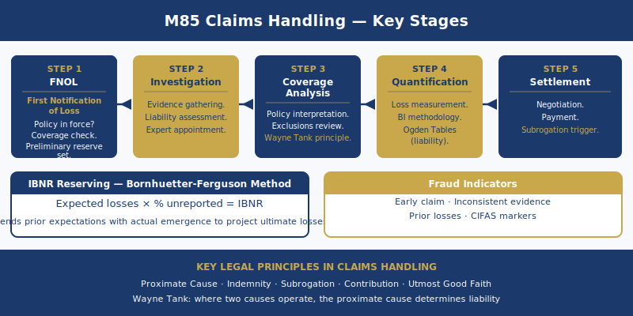

# M85 Claims Practice Assignment Help — CII Diploma in Insurance

M85 Claims Practice is a 20-credit Level 4 optional unit of the CII Diploma in Insurance, assessed by written examination — not MCQ. The written exam presents complex claims scenarios and requires candidates to apply professional claims judgment: appointing the right specialists with documented justification, determining coverage using proximate cause doctrine, calculating business interruption indemnities using the full turnover basis methodology, valuing personal injury claims using the Judicial College Guidelines and Ogden Tables, identifying organised fraud and selecting the correct insurer remedy, and setting adequately supported claims reserves. M85 is taken by insurance professionals in claims roles — at direct insurers, Lloyd's syndicates, and loss adjusting firms — who have completed the Certificate-level IF4 unit and are building toward the full Diploma qualification. What distinguishes M85 from IF4 is the level of professional tool application required: IF4 tests awareness of the claims handling process; M85 tests the ability to apply specific technical methodologies — BI calculation, PI valuation, fraud remedies, IBNR estimation — under conditions of competing coverage considerations, contested causation, and quantum uncertainty.

---

## What Does M85 Cover? — Claims Practice at Diploma Level

M85 covers the full professional claims workflow at practice level — investigation management and specialist appointment, coverage analysis using proximate cause and policy interpretation, business interruption claims methodology, liability claims and personal injury valuation, fraud management at professional level, claims reserving, and subrogation recovery strategy. Practice level in M85 means the candidate must demonstrate professional claims judgment in complex scenarios, not describe what claims handlers do. An M85 answer that defines business interruption without calculating the indemnity from scenario figures will not score at the required level.

### From IF4 to M85 — What Practice Level Means

IF4 (Certificate, Level 3, 15 credits, MCQ) introduces the claims handling process — notification, investigation, coverage assessment, and settlement at a foundational level. M85 (Diploma, Level 4, 20 credits, written exam) requires the candidate to practise the process using professional tools. Specifically: make specialist appointment decisions with documented justification for each appointment; apply the *Wayne Tank* concurrent causes rule to determine coverage where multiple causes operate simultaneously; calculate a business interruption indemnity using the full turnover basis methodology including the Trends Clause adjustment; value a personal injury claim using Judicial College Guidelines brackets and the Ogden Tables multiplier method; identify organised fraud indicators and apply the correct insurer remedy (not all fraud scenarios warrant the same remedy); and set a claims reserve with explicit justification, including an IBNR estimate where the class of business warrants one.

---

## How Is M85 Assessed? — Written Exam Format and What Examiners Require

M85 is assessed by written examination — not multiple choice. Candidates who have only sat Certificate MCQ assessments must change their preparation methodology fundamentally. MCQ technique — elimination, pattern recognition, working from knowledge recall — does not transfer to M85 written answers.

Short-answer questions (approximately 10–15 marks) require a definition followed by immediate application to the scenario. A candidate who defines the Rate of Gross Profit formula without calculating it from the figures in the question will not score at M85 level. Extended answer questions (25 marks) present a complex, multi-issue claim — a major commercial property loss with BI implications and potential fraud indicators; a catastrophe event with multiple claimants and a contested coverage question; a serious personal injury claim with quantum, liability, and PPO considerations — and require the candidate to manage the claim, assess coverage, appoint the appropriate specialists, and advise on reserve level and recovery strategy.

The indicative pass mark for M85 is approximately 55%. Study hours are estimated at 100–130 hours, with priority weighting toward BI methodology (the full turnover basis calculation is tested in almost every sitting), personal injury valuation (Ogden Tables and JCG brackets are tested in every PI scenario), and fraud remedies (the distinction between void ab initio, rescission, and repudiation is a consistent examiner focus).

---

## Claims Investigation Management — Appointing the Right Specialist

Specialist appointment is the first active decision in any large or complex claim. M85 tests whether the candidate can identify which specialist is required, justify the appointment based on the specific claim characteristics, and instruct the specialist effectively. Generic answers recommending "appoint a specialist" without naming the specialist type and justification will not score.

### Loss Adjusters — Appointment Criteria and Role

Loss adjusters are appointed for large property claims exceeding the insurer's internal handling threshold — typically claims above £25,000–£50,000, though this threshold varies by insurer. They are also appointed for: complex claims where determining the cause of loss and scope of damage requires on-site investigation; claims with multiple interested parties (landlord and tenant, mortgagee, co-insurer) requiring coordinated communication and progress reporting; catastrophe events where the insurer's in-house capacity is overwhelmed and field adjusting resource is required; and claims where fraud indicators suggest the need for a documented independent field investigation.

The loss adjuster acts as the insurer's agent for investigation purposes. Their role encompasses: attending the loss location and preparing a scope of damage report; assessing whether the cause of loss is covered under the policy and whether exclusions apply; verifying sum insured adequacy and checking for underinsurance (where the sum insured is below reinstatement value, the average clause reduces the settlement proportionately); agreeing the scope and cost of reinstatement works with the insured's contractors; and certifying interim and final payments as reinstatement progresses.

The **instruction letter to the loss adjuster** must specify the coverage issues requiring investigation (not just "investigate the claim"), the reserve the insurer has set so the adjuster can advise if it is inadequate, any fraud indicators already identified, and whether legal advice is required alongside adjusting. A loss adjuster appointed without targeted instructions produces a report that does not address the coverage questions the insurer actually needs answered.

### Engineers, Forensic Accountants, and Solicitors — When Each is Used

**Engineers** are appointed for: machinery breakdown claims (to determine whether the failure mode is a sudden and unforeseen breakdown — which is covered — or gradual deterioration and wear and tear — which is excluded); construction defect claims (to assess whether the defect constitutes a covered latent defect or excluded faulty workmanship); structural damage claims (to determine whether structural failure was caused by an insured peril or a pre-existing condition that removes coverage); and fire origin and cause investigations alongside forensic fire investigators to establish whether ignition was electrical fault, arson, or excluded process combustion.

**Forensic accountants** are essential for business interruption claims of any material size. The forensic accountant verifies the insured's trading accounts, calculates the Rate of Gross Profit, assesses actual turnover during the interruption period, projects the turnover that would have been achieved but for the loss (adjusted for trend), and checks whether the Additional Increased Cost of Working figure is economically justified. Forensic accountants are also appointed for fidelity guarantee claims (employee dishonesty — verification of the extent of funds misappropriated) and financial crime claims.

**Solicitors** are appointed for: subrogation recovery actions (pursuing the third party responsible for the loss in the insured's name, where the cost-benefit of recovery justifies litigation); large liability claims where litigation is probable (defending serious personal injury and employers' liability claims); coverage disputes requiring a legal opinion on policy interpretation where the dispute cannot be resolved between insurer and insured without independent legal advice; and fraud investigation civil recovery actions where the insurer seeks to recover a fraudulent payment from the fraudster through civil proceedings.

---

## Coverage Analysis at Practice Level — Proximate Cause and Policy Interpretation

Coverage analysis in M85 requires the candidate to apply proximate cause doctrine and policy interpretation rules to multi-cause scenarios — not state definitions. The examiner tests whether the candidate can reach a coverage conclusion from the facts presented, not whether they know the definition of proximate cause.

### Proximate Cause — Wayne Tank and Concurrent Causes

**Proximate cause** is the dominant, effective, or operative cause of the loss — not the most recent event in a chain, and not the first in time. In M85 scenarios with a single unbroken chain of causation, the underwriting principle from *Leyland Shipping v Norwich Union* [1918] applies: the first cause in efficiency is the proximate cause, and all consequential losses flowing from that cause are covered if the proximate cause is an insured peril — even if an intermediate event in the chain would have been excluded had it occurred independently.

**Wayne Tank & Pump Co v Employers Liability [1974] QB 57 — the concurrent causes rule** is the central authority for M85 coverage analysis. In *Wayne Tank*, a plastic duct overheated (excluded peril — faulty design and materials) and ignited a fire in the insured's premises (insured peril — fire). Both the excluded peril and the insured peril were concurrent proximate causes of the same loss. The Court of Appeal held that the entire loss was excluded — an insured cannot recover where an excluded peril is one of the proximate causes alongside an insured peril, even if the insured peril also independently qualifies as proximate. The *Wayne Tank* principle means that concurrent causation — where two causes operate simultaneously, one insured and one excluded — defeats the claim if the excluded peril is among the proximate causes.

**Applying Wayne Tank in M85 exam answers**: Coverage questions in M85 present scenarios with two or more causes. The candidate must: identify each cause separately; classify each as insured, excluded, or neutral under the policy terms; determine whether the causes are sequential (single proximate cause — *Leyland Shipping* analysis) or concurrent (simultaneous — *Wayne Tank* analysis); and conclude on coverage. A candidate who states "the proximate cause is the dominant cause" without completing the sequential versus concurrent analysis, and then applying *Wayne Tank* where concurrent causes exist, will not achieve full marks on a coverage question.

### Policy Interpretation — Contra Proferentem and Conditions Precedent

**Contra proferentem** is the rule that genuine ambiguity in policy wording is construed against the insurer who drafted it. The ambiguity must be real — courts will not create ambiguity by reading wording artificially or in strained terms. Contra proferentem is a last-resort rule, applied only after all standard rules of construction — purposive interpretation, reading the contract as a whole, commercial common sense — have failed to resolve the ambiguity.

**Conditions precedent to the claim** are obligations the insured must satisfy before the insurer's liability to pay is triggered. Common conditions precedent include: notification of loss within a specified period (30 days from discovery, or "as soon as practicable"); submission of a completed claim form; provision of all relevant business records for BI claims; obtaining the insurer's written consent before admitting liability to a third party. Pre-Insurance Act 2015 common law treated breach of a condition precedent as an absolute bar to the claim with no prejudice requirement. Post-Insurance Act 2015, for commercial policyholders, the insurer can only rely on a condition precedent breach where it was actually prejudiced by the breach — by operation of the implied term under s.13A. This distinction matters in M85 exam scenarios where the contract date is given and the policyholder is identified as commercial.

---

## Business Interruption Claims — Full Methodology

Business interruption methodology is the highest-weighted calculation topic in M85 and is tested in almost every exam sitting. The candidate must work through the full turnover basis calculation, apply the Trends Clause where scenario data indicates a business trend, and assess the AICOW for economic validity.

### The Turnover Basis of Settlement — Core Framework

The standard BI indemnity formula is:

**Indemnity = (Rate of Gross Profit × Reduction in Turnover during the Indemnity Period) + Additional Increased Cost of Working (subject to the economic limit)**

**Gross Profit in BI insurance** is defined as Turnover minus Uninsured Working Expenses. Uninsured Working Expenses are the variable costs that cease when the business is interrupted — they must be specifically listed in the policy schedule. Examples include: purchases of raw materials, packaging materials, and direct labour on piece-work contracts. Uninsured Working Expenses do not include wages of permanent staff, rent, rates, insurance premiums, or loan interest — these fixed overheads continue during the interruption and are therefore included in the BI indemnity.

**Rate of Gross Profit** is calculated from the insured's last full accounting year before the loss:

Rate of Gross Profit = (Gross Profit ÷ Turnover) × 100

*Example*: Gross Profit = £600,000; Turnover = £1,500,000. Rate of Gross Profit = 40%.

**Reduction in Turnover** is the difference between projected turnover (what the business would have achieved during the indemnity period but for the loss) and actual turnover achieved (including any partial trading from undamaged parts of the premises).

*Example*: Projected turnover for a 6-month interruption period = £750,000. Actual turnover achieved during that period = £300,000 (partial trading from one undamaged area). Reduction in Turnover = £450,000. BI indemnity before AICOW = 40% × £450,000 = £180,000.

### Trends Clause — Adjusting for Business Trends

The Trends Clause adjusts both the Rate of Gross Profit and the projected turnover to reflect any trend or circumstance affecting the business independently of the insured event. This is one of the most frequently mis-applied elements in M85 exam answers — candidates who mention the Trends Clause without applying it to the specific scenario data will not score the available marks.

Two adjustments the Trends Clause governs:

1. **Adjusting the Rate of Gross Profit**: If the business was growing or declining in the period before the loss, the Rate of Gross Profit from the last accounting year may overstate or understate the rate applicable during the interruption period. A growing business that increased gross profit margin from 35% to 40% year-on-year should have the Rate of Gross Profit projected forward to reflect the continuation of that trend — the forensic accountant calculates the adjusted rate for the interruption period rather than using the historical rate mechanically.

2. **Adjusting projected turnover**: The projected turnover must reflect what the business would actually have achieved during the interruption period but for the loss — including any trend affecting it independently. If the business was in long-term revenue decline due to structural market changes unrelated to the fire, projected turnover must be adjusted downward. The insurer does not indemnify the insured for losses that would have occurred regardless of the insured event.

In M85 exam scenarios, the Trends Clause adjustment direction must be stated (upward for growth trends, downward for decline) and its quantified effect on the calculated indemnity must be shown.

### Maximum Indemnity Period and AICOW

**Maximum Indemnity Period (MIP)** is the period during which the BI policy provides indemnity — selected by the insured at inception. Common options are 12, 18, 24, and 36 months. The MIP must be long enough to cover full recovery of turnover to pre-loss levels. For complex manufacturing businesses, specialist commercial properties requiring bespoke machinery replacement, or businesses in multi-let premises requiring landlord reconstruction, 36 months is often the minimum adequate MIP. Underinsurance of the MIP is a frequent cause of BI claim underpayment: if the business has not fully recovered by the end of the MIP, the BI indemnity ceases at that date regardless of ongoing trading loss. The claims handler must advise the insured early in the claim if the selected MIP appears insufficient for the expected recovery timeline.

**Additional Increased Cost of Working (AICOW)** covers expenditure beyond normal that the insured incurs during the indemnity period to reduce the turnover loss. AICOW is recoverable only to the extent that it is economic — the expenditure must cost less than the BI loss it saves. *Example*: An insured spends £50,000 on temporary emergency premises and additional transport to maintain partial trading. This expenditure reduces the projected BI loss by £80,000. The AICOW is economic (£50,000 saves £80,000) and is recoverable in full. If the expenditure had cost £90,000 to save the same £80,000, only £80,000 would be recoverable — the economic limit caps the AICOW at the value of the loss avoided.

---

## Liability Claims — Personal Injury Valuation at Practice Level

Personal injury valuation in M85 requires the candidate to apply two distinct tools — the Judicial College Guidelines for general damages and the Ogden Tables for special damages — and reach a quantified assessment, not a general description of how claims are valued.

### General Damages — Judicial College Guidelines

**General damages** compensate for non-financial losses — pain, suffering, and loss of amenity (PSLA). They are assessed by reference to the Judicial College Guidelines (JCG), which provide bracket ranges for awards by injury type and severity. JCG brackets are not binding on courts but are the standard reference used in settlement negotiations, mediation, and litigation across the UK personal injury market.

**Applying JCG brackets in M85 exam answers**: The candidate must identify the injury category from the scenario, name the relevant JCG chapter and injury category bracket (not memorise precise figures — the exam does not require exact bracket memorisation, but does require the correct bracket category to be named), and apply aggravating or mitigating factors that affect where within the bracket the award falls. Aggravating factors include: younger age of claimant (longer period of suffering); pre-existing vulnerability that has been worsened; loss of specific amenities of high personal importance. Mitigating factors include: good recovery prognosis within a defined period; pre-existing condition that would have caused similar disability regardless of the injury. The PSLA figure must be stated with reasoning for the position within the bracket.

### Special Damages — Ogden Tables and the Discount Rate

**Special damages** cover financial losses: past losses from the date of injury to trial (lost earnings, medical expenses incurred, care costs paid) and future losses (future loss of earnings, future care costs, future medical treatment, future transport adaptation costs).

**Future loss calculation — Ogden Tables method**:

Future loss = Annual loss × Ogden multiplier

The annual loss is the net annual figure (after tax and National Insurance) for earnings loss, or the annual net cost of care. The Ogden multiplier reflects two variables: the claimant's life expectancy (from the actuarial tables in the Ogden Tables, based on age and gender) and the discount rate.

**The discount rate** is set by the Lord Chancellor under the Damages Act 1996 s.1. The current rate is **-0.25%** (set August 2019 — previously -0.75% from February 2017, and before that +2.5% from 2001). A negative discount rate reflects the expectation that a claimant investing a lump sum conservatively will earn less than inflation in the current low-yield investment environment. The lump sum must therefore be larger to ensure the claimant can meet future needs in full. A negative discount rate produces higher multipliers and therefore larger lump sum awards than a positive rate. M85 candidates must state the current discount rate of -0.25% when applying Ogden Tables in exam answers — using an outdated rate (such as +2.5%) will produce a materially wrong calculation and lose significant marks.

**Periodical Payment Orders (PPOs)** are available for very large personal injury claims with long-term care needs. Under a PPO, the court orders periodic payments instead of a lump sum — typically indexed to ASHE 6115 (the Annual Survey of Hours and Earnings index for care workers) rather than RPI or CPI. PPOs protect the claimant against care cost inflation and remove investment risk. For the insurer, PPOs create long-tail reserving uncertainty: the total cost is unknown at settlement because it depends on the claimant's actual lifespan. M85 candidates must understand that PPO reserves require a life expectancy loading and that the ASHE indexation means future payment growth will track care worker wage inflation rather than general price inflation — potentially diverging materially from CPI over a long-tail claim period.

---

## Fraud Management at Professional Level

Fraud management in M85 tests whether the candidate can identify organised fraud patterns from scenario data, apply the correct SIU referral process, and select the right insurer remedy for the specific type of fraud present. Not all fraud scenarios warrant the same remedy — applying the wrong remedy to the wrong scenario type is one of the most common M85 exam failures.

### Identifying Organised Fraud at Professional Level

**Staged motor accident indicators** include: multiple claimants in one vehicle; all claimants represented by the same firm of solicitors before any notification to the insurer; CCTV footage inconsistent with the alleged collision; the accident location appearing in fraud hotspot data on the Claims and Underwriting Exchange (CUE) database; vehicle hire and storage charges disproportionate to the vehicle's market value; and a pattern of similar accidents involving the same solicitor or vehicle recovery firm across multiple insurers.

**Property fraud indicators** include: the insured appearing multiple times on CUE for similar losses at different addresses over a short period; high-value items claimed with no evidence of ownership (no receipts, photographs, warranties, or purchase records); the loss occurring within the first 30 days of inception or immediately before renewal; and claim figures submitted initially being significantly higher than subsequently evidenced losses.

**SIU referral thresholds**: The insurer's Special Investigations Unit must be instructed when two or more fraud indicators are identified simultaneously; the CUE database shows prior fraud history for the insured or any claimant named on the claim; the claim value exceeds the internal referral threshold combined with at least one indicator; or organised ring activity is suspected across multiple claims with common patterns. Each referral must be documented — the claims handler records the specific indicators observed and the factual basis for the referral. A referral based on intuition alone, without documented indicators, will not withstand scrutiny if challenged.

### Insurer Remedies for Fraud — Void Ab Initio, Rescission, Repudiation

**Void ab initio**: The policy is treated as if it never came into existence. This remedy applies where there was fraudulent misrepresentation at inception — the policyholder deliberately provided false information to obtain the policy. All claims are refused under a void policy; the insurer may retain the premium paid. This is an inception-stage remedy, not a claims-stage remedy.

**Rescission**: The policy is set aside from inception due to material non-disclosure or misrepresentation. Under the Insurance Act 2015 (business policyholders) and Consumer Insurance (Disclosure and Representations) Act 2012 (consumer policyholders), proportionate remedies apply before avoidance is automatic. For deliberate or reckless misrepresentation at inception, the insurer may avoid the contract. For non-deliberate misrepresentation, a proportionate remedy — reducing the claim in proportion to the premium shortfall, or treating the contract as if amended terms applied — is required before avoidance can be considered. The distinction between void ab initio and rescission for M85 purposes: void ab initio requires proven deliberate fraud at inception; rescission covers a wider range of inception-stage non-disclosure, with the remedy graduated by the insured's culpability.

**Repudiation of the claim**: The specific fraudulent claim is denied, but the policy itself continues to cover other legitimate claims. Under the common law fraud principle confirmed in *Versloot Dredging BV v HDI Gerling* [2016] UKSC and the Consumer Insurance Act 2012 s.12, a fraudulent claim allows the insurer to repudiate the entire claim — including any legitimate portion of the same claim — and may give grounds to avoid the policy going forward. However, the Supreme Court in *Versloot Dredging* modified the position on fraudulent devices: a fraudulent device used to support an otherwise valid claim (exaggerating rather than fabricating) does not forfeit the claim if the exaggeration was immaterial to the insurer's decision to pay.

The M85 exam application: a fraud scenario requires identifying the type of fraud (inception-stage versus claims-stage), selecting the correct remedy with justification, and specifying what evidential steps are required before the remedy is applied — the insurer cannot void or repudiate without documented evidence that will withstand challenge.

---

## How Do Reserving and Recovery Strategy Connect M85 Claims Practice to the Broader Diploma Pathway?

Reserving and subrogation recovery are the bookend disciplines of claims practice — reserving manages the financial exposure from the point of notification, and recovery management reduces the net cost after settlement. Both connect M85 to the financial framework covered in M92 Insurance Business and Finance, which analyses how reserve adequacy and recovery income affect the insurer's combined ratio. Understanding claims reserve methodology in M85 context provides the financial management foundation for M92's analysis of claims ratios.

---

## Claims Reserving Methodology

Accurate reserving is a core professional obligation in claims practice. An inadequate reserve misrepresents the insurer's financial position; an excessive reserve overstates liabilities and creates false financial signals. M85 tests whether the candidate can set a justified reserve — not just name the reserve types.

**Case reserve** is set at first notification based on the claims handler's assessment of the likely settlement cost, using the information available at that stage. The case reserve must reflect: the probability of liability being established; the estimated quantum including general and special damages for PI claims, or the estimated reinstatement cost for property claims; anticipated claimants' legal costs; and loss adjustment expenses. Case reserves must be reviewed and updated as new information emerges — a reserve set at notification and never reviewed becomes unreliable as the claim develops. In M85 exam scenarios, candidates must state an initial case reserve figure with explicit justification.

**IBNR — Incurred But Not Reported** is the reserve for claims that have occurred within the policy period but have not yet been notified to the insurer. IBNR is calculated actuarially using the development triangle method — comparing how claims for previous underwriting years developed from initial notification to ultimate settlement, and projecting that development pattern forward to estimate the ultimate incurred cost for underwriting years where claims are still immature. IBNR is most material in employers' liability (latent disease — mesothelioma claims arising 30–40 years after asbestos exposure); professional indemnity (particularly occurrence-based policies, where the claim can arise years after the negligent act); and casualty reinsurance.

**ULAE — Unallocated Loss Adjustment Expenses** are the overhead costs of the claims function that cannot be allocated to individual claims — claims department salaries, IT systems maintenance, management costs, training costs. ULAE must be reserved for separately alongside case reserves and IBNR, and included in the overall claims liability figure.

**Claims inflation adjustment** is the most commonly understated reserve component. Reserves must be adjusted for expected future inflation in claims costs: medical treatment cost inflation (typically above CPI); care cost inflation linked to ASHE wage growth for care workers; legal cost inflation (solicitors' hourly rates and court fees). Failure to apply adequate claims inflation loading is a systematic source of reserve deficiency that compounds over time, particularly on long-tail liability claims with 10–20 year development periods.

---

## Subrogation Recovery Management Strategy

Subrogation recovery reduces the insurer's net claims cost by recovering from the third party responsible for causing the loss. The decision to pursue recovery, and the strategy for doing so, require professional judgment — not every recovery is worth pursuing.

**Decision to pursue recovery** requires cost-benefit analysis: expected recovery (probability of success multiplied by the likely recovery amount) compared against the legal costs of pursuit. Four factors govern the decision: creditworthiness of the potential defendant (a defendant with no assets or in insolvency will not satisfy a judgment — a successful legal action produces no recovery); the limitation period (3 years from discovery for personal injury claims; 6 years from damage for contract and property claims — proceedings must be issued before limitation expires, regardless of the insurer's internal review timetable); availability and quality of evidence (can the insured prove the third party's negligence caused the specific loss?); and proportionality (on small claims, negotiated settlement without litigation may recover a lower amount at a fraction of the legal cost).

**Conducting recovery in the insured's name**: Subrogation proceedings are brought in the insured's name — the insurer does not sue in its own name. The insured must cooperate fully: providing documents, attending court as a witness where required, and giving instructions to solicitors at the insurer's direction. The insured's obligation to cooperate is typically a condition of the policy — breach of the cooperation obligation allows the insurer to cease funding the recovery action.

**Recovery proceeds allocation** where recovery is only partial: the insured's uninsured excess or deductible is recovered first from the proceeds; the insurer then recovers its claim payment from the balance. Where recovery is insufficient to satisfy both the insured's excess and the insurer's payment, the proceeds are shared pro rata between the insured (for the uninsured element) and the insurer (for the indemnified element).

---

## How to Write M85 Exam Answers — Professional Claims Judgment in Scenarios

M85 extended answer questions present multi-issue claims — a large commercial property loss with BI implications and potential fraud indicators; a catastrophe event with multiple claimants and a contested coverage question; a serious personal injury claim with quantum, liability, and PPO considerations. The candidate must manage the claim, assess coverage, appoint the right specialists, quantify the loss, and advise on reserve and recovery strategy — all in a structured written answer that demonstrates professional judgment, not general process description.

**Short-answer questions (10–15 marks)**: State the concept precisely and apply it directly to the scenario figures. For a BI question — state the formula, calculate the indemnity using the figures given, identify whether a Trends Clause adjustment is indicated by the scenario data, and state the adjusted indemnity. Do not describe BI claims methodology in general terms without applying the method to the numbers presented.

**Extended answer questions (25 marks)**: The recommended structure for complex claims scenarios is: (1) Coverage assessment — identify each cause of the loss; classify as insured, excluded, or neutral; apply *Wayne Tank* if concurrent causes are present; state the coverage conclusion clearly. (2) Specialist appointment — identify each specialist required; justify the appointment with specific reference to the claim's characteristics. (3) Quantum assessment — for BI, calculate the indemnity step by step including the Trends Clause adjustment; for PI, identify the relevant JCG bracket and apply the Ogden Tables method for future losses, stating the discount rate of -0.25%. (4) Reserve recommendation — state the case reserve and flag any IBNR, ULAE, or claims inflation considerations. (5) Recovery and fraud — identify any fraud indicators; state the appropriate remedy with justification; assess subrogation recovery prospects and the cost-benefit calculation.

**The four most common M85 exam failures**: applying *Wayne Tank* incorrectly by treating concurrent causes as a sequential chain; calculating the BI indemnity without applying the Trends Clause adjustment when the scenario indicates a business trend; using Ogden multipliers without stating the current discount rate of -0.25%; and recommending void ab initio in a repudiation-only scenario (fraud in the claim itself, not at inception).

Our M85 assignment help covers BI calculation practice with worked examples, personal injury valuation exercises using Ogden Tables, fraud scenario analysis, coverage dispute drafting, and structured answer templates for M85 extended questions.

> **Need expert help with your M85 written exam?** Contact us today.

---

## M85 in the CII Diploma in Insurance Pathway

M85 Claims Practice is the natural Diploma-level progression for professionals who have completed IF4 (Insurance Claims Handling) at Certificate level. IF4 introduced the claims process at Level 3 using MCQ; M85 adds the professional tools that define claims practice at Level 4 — BI methodology, PI valuation frameworks, fraud investigation remedies, and actuarial reserving concepts. The transition from IF4 to M85 parallels the transition from M80 (Underwriting Practice) from IF3 — both Diploma optional units require applied professional judgment that Certificate-level units do not test.

After M85, the advanced career step for claims professionals is the [820 Advanced Diploma Claims assignment help](/820-assignment-help) unit, which addresses strategic claims management, insurance fraud strategy at an organisational level, and claims function leadership. M85 provides the practice-level foundation on which 820 builds strategically. M85's coverage analysis content — particularly proximate cause doctrine and policy interpretation — shares significant ground with [M05 Insurance Law assignment help](/m05-assignment-help), which covers the Insurance Act 2015 framework, conditions precedent, and contra proferentem at the Diploma legal analysis level.

**Internal links:**
- [CII Diploma in Insurance assignment help](/cii-diploma-in-insurance-assignment-help) — Diploma hub page
- [IF4 Insurance Claims Handling assignment help](/if4-assignment-help) — Certificate predecessor unit
- [M80 Underwriting Practice assignment help](/m80-underwriting-practice-assignment-help) — underwriting counterpart — shared subrogation and coverage analysis content
- [M05 Insurance Law assignment help](/m05-assignment-help) — insurance law context for proximate cause and conditions precedent
- [CII assignment help](/cii-assignment-help) — master pillar page

---

## Frequently Asked Questions about M85

**Q1: How hard is M85 compared to other CII Diploma units?**

M85 is one of the more technically demanding Diploma optional units because it combines quantitative methodology — BI calculation, PI valuation using Ogden Tables — with professional judgment requirements — specialist appointment decisions, fraud investigation strategy, and coverage analysis using case law. The most common failure is producing generic claims management answers without applying the specific tools required at M85 level. Candidates who cannot calculate a BI indemnity step by step including the Trends Clause, or who cannot apply the *Wayne Tank* concurrent causes rule to a specific scenario, will not achieve a passing score. Practising BI calculations with worked examples and PI valuation using Ogden Tables is the single most important exam preparation activity.

**Q2: How long does M85 take to study?**

Most candidates with a claims background complete preparation in 90–120 hours across 10–15 weeks. Key study priorities are BI methodology (the full turnover basis calculation including the Trends Clause — tested in almost every sitting), personal injury valuation (Ogden Tables discount rate at -0.25% and JCG brackets — tested in every PI scenario), and fraud remedies (the distinction between void ab initio, rescission, and repudiation is a consistent examiner focus). Candidates without a BI or liability claims background typically need additional preparation time for the calculation-heavy sections — plan for 120–140 hours if BI and PI valuation are unfamiliar in practice.

**Q3: How is M85 different from IF4?**

IF4 (Certificate, Level 3, 15 credits, MCQ) introduces the claims handling process — notification, investigation, settlement, and recoveries at a foundational level. M85 (Diploma, Level 4, 20 credits, written exam) requires the candidate to apply professional claims tools to complex scenarios: BI methodology with the full turnover basis calculation, personal injury valuation using Ogden Tables and the -0.25% discount rate, *Wayne Tank* coverage analysis for concurrent causes, SIU fraud referral and insurer remedies, and IBNR reserving. IF4 tests awareness; M85 tests competence in applying the tools under examination conditions.

**Q4: What written answer structure does M85 require?**

M85 extended answers must work through a scenario systematically: coverage assessment first (is the loss covered? — proximate cause analysis, concurrent causes check, conditions precedent compliance); then quantum (BI calculation or PI valuation as required by the scenario); then specialist appointment recommendations with justification; then reserve and recovery strategy. Answers that jump to quantum without addressing coverage lose significant marks. Answers that describe the claims process in general terms without applying the specific methodology to the scenario figures do not demonstrate the professional judgment M85 requires at Level 4.

**Q5: What is the pass mark for M85 and how is it scored?**

The indicative pass mark for M85 is approximately 55%. The CII uses scaled scoring. Candidates should ensure competence across all major syllabus areas — BI methodology, PI valuation, fraud management, and reserving are all tested. Concentrating only on BI at the expense of PI, fraud, or reserving topics creates a material risk of failing to score adequately in those question areas. Extended answer questions (25 marks each) carry the highest individual mark weight and are where the most significant marks are gained or lost depending on the quality of professional judgment demonstrated in the answer.
