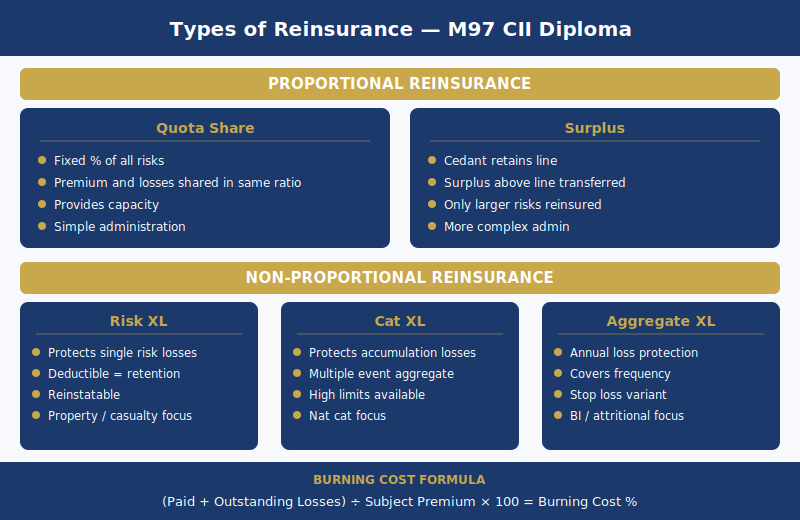

# M97 Reinsurance Assignment Help — CII Diploma in Insurance

M97 Reinsurance is a 30-credit Level 4 written exam unit within the CII Diploma in Insurance — the highest credit value of any optional Diploma unit. The written exam requires structured analytical answers on reinsurance structures, pricing methodology, and the global reinsurance market. M97 is taken by Diploma candidates specialising in reinsurance, underwriting, or broker roles involving reinsurance placement. The unit's 30-credit weight reflects its technical depth: candidates must understand and apply the mechanics of proportional and non-proportional treaty structures, calculate burning cost from loss data, derive rate on line and payback period, and distinguish facultative from treaty reinsurance with specific use cases. Approximately 120–150 study hours are required to reach exam standard, with the most consistent study feedback indicating that candidates underestimate the time needed to develop numerical facility with reinsurance pricing — reading the concepts is insufficient; calculating from data is what the exam demands.

---

## What Does M97 Cover? — Major Query Need: understanding the M97 syllabus

M97 covers the full structure of the reinsurance market at Diploma practice level: why reinsurance exists, proportional treaty mechanisms (quota share and surplus), non-proportional treaty mechanisms (risk XL, cat XL, aggregate XL, stop loss), facultative reinsurance, pricing methodology (burning cost and rate on line), assessment format and written exam technique, the global reinsurance market, retrocession, and credit risk management. Practice level in M97 means the candidate must explain mechanics with numerical examples, not merely name the structures. An M97 written answer that defines quota share without showing how the premium and loss split operates will not score at the required level.

### Why Reinsurance Exists — The Five Functions

Reinsurance serves five distinct purposes. M97 requires candidates to articulate all five with specific application, not list them as headings.

1. **Capital protection**: An insurer writing a £50 million property risk retains capital against the full exposure on its balance sheet. Reinsurance transfers part of that exposure, releasing tied-up capital for deployment elsewhere — improving return on equity for the cedant. Without reinsurance, writing large individual risks would require proportionately large capital reserving that constrains the insurer's ability to grow other classes.

2. **Capacity provision**: Without reinsurance, an insurer can only write risks up to its net retention limit — the amount it can absorb from a single risk without threatening solvency. Reinsurance enables writing risks that individually exceed the insurer's own capacity. This is particularly significant for large commercial property, marine hull, and offshore energy risks where individual values exceed £100 million or more.

3. **Result stabilisation**: A catastrophe year — major windstorm, earthquake, or flood — without adequate reinsurance could eliminate an insurer's annual profit or threaten solvency. Reinsurance smooths the loss ratio across years, protecting the insurer's financial stability in catastrophe years and making its annual results predictable. This function is especially important for catastrophe-exposed classes: property, aviation, and marine.

4. **Spread of risk**: Reinsurers accept business from cedants across multiple countries, classes, and lines of business. This geographic and class diversification gives the reinsurer a more stable overall portfolio — individual country or class catastrophes are offset by uncorrelated results elsewhere. From the cedant's perspective, the reinsurer's willingness to accept concentrated exposures that a single-market insurer cannot absorb domestically makes large, geographically concentrated risks insurable.

5. **Expertise acquisition**: Specialist reinsurers — particularly in marine, aviation, offshore energy, and political risk — accumulate underwriting data, actuarial loss experience, and risk assessment expertise across global markets. The cedant accesses this knowledge through the reinsurance relationship: the reinsurer's willingness to accept a risk at a specific rate, and their feedback on risk quality, carries pricing information that the cedant can use in its own underwriting decisions.

### Proportional Treaty Reinsurance — Quota Share and Surplus

Both quota share and surplus are proportional treaty structures — the premium and losses are shared between cedant and reinsurer in a defined proportion. They differ fundamentally in how that proportion is determined for each risk.

**Quota share**: The cedant cedes a fixed percentage of every risk in the defined class. That percentage applies to every risk in the class — large, small, profitable, unprofitable alike. A 30% quota share means: the cedant retains 70% of the premium and pays 70% of every loss; the reinsurer receives 30% of the premium and pays 30% of every loss. The **ceding commission** paid by the reinsurer to the cedant represents the reinsurer's contribution to the cedant's acquisition costs (broker commission, policy expenses, management overhead). Quota share is simple to administer but inflexible — the cedant cedes the same proportion of profitable small risks as of large, volatile risks. Main use cases: new classes of business where the cedant lacks sufficient loss experience to price with confidence; classes with volatile historical results; situations where the cedant needs broad capacity support across the entire class.

**Surplus treaty**: The cedant retains a fixed monetary amount per risk — the "line" — typically set at the cedant's comfortable net retention for that class. The surplus above that line, up to a maximum number of surplus lines, is ceded to the treaty. The maximum cession per risk is the number of surplus lines multiplied by the cedant's retention line.

*Example*: Cedant's line = £500,000. Treaty provides 9 surplus lines = maximum cession of 9 × £500,000 = £4,500,000. For a risk with a total sum insured of £2,000,000: cedant retains £500,000 (25% of the risk); cedes £1,500,000 (75%) to the surplus treaty. For a risk with a total sum insured of £400,000: cedant retains the entire risk (below the line — no cession). For a risk with a total sum insured of £5,500,000: cedant retains £500,000 (9.1%); cedes £4,500,000 (81.8%) to the surplus treaty — but cannot cede the remaining £500,000 under this treaty (beyond the 9-line maximum), so must either retain it net or place it facultatively.

Surplus is more flexible than quota share: small risks below the line are retained in full; large risks are ceded in proportion to their size above the line. The premium and loss proportions vary by individual risk, reflecting the cedant's relative exposure on each.

### Non-Proportional Treaty Reinsurance — Excess of Loss

Non-proportional reinsurance responds to the amount of the loss rather than a proportion of the risk. The cedant bears all losses up to a retention; the reinsurer pays the excess above that retention up to a defined limit. Premium and loss are not shared in the same proportion — the premium is separately calculated and fixed.

**Risk XL (per-risk excess of loss)**: The reinsurer pays losses on any single risk that exceed the cedant's retention, up to the reinsurance limit. Structure is expressed as "limit xs retention." Example: £1m xs £500k means the reinsurer pays the portion of any single-risk loss between £500,000 and £1,500,000.

- If the loss is £800,000: cedant pays £500,000; reinsurer pays £300,000.
- If the loss is £2,000,000: cedant pays £500,000; reinsurer pays £1,000,000 (limit exhausted); cedant retains the excess above £1,500,000 unless a second layer applies.

Risk XL protects the cedant against large individual losses on single risks. It does not protect against an accumulation of many smaller losses.

**Cat XL (catastrophe excess of loss)**: Per-event cover. The reinsurer pays the aggregate of all losses from a single catastrophe event that exceed the cedant's event retention, up to the cat XL limit. Catastrophe events must be defined precisely in the treaty — typically using hours clauses (72 hours for windstorm; 168 hours for flood) to define the maximum event window within which losses aggregate to one event for cat XL purposes. **Reinstatement provisions** are a critical cat XL feature: after the reinsurer pays a cat XL loss, the treaty limit is reinstated — usually one automatic reinstatement at 100% additional premium or at pro-rata additional premium. A cedant who exhausts the cat XL limit in one hurricane season needs the reinstatement to remain protected for the remainder of the policy year.

**Aggregate XL**: The reinsurer pays when the cedant's aggregate losses for a defined class across the policy year exceed an annual retention, up to a limit. This protects against an accumulation of attritional losses in a bad year — multiple medium-sized losses each below the risk XL retention — even if no single loss or event is large. Less commonly purchased than risk XL or cat XL, but important for classes with high frequency and variable severity.

**Stop loss**: The reinsurer pays when the cedant's loss ratio for a defined class exceeds a specified level — for example, the reinsurer pays losses above a 90% loss ratio up to a 120% loss ratio. Stop loss provides direct protection against an adverse underwriting year. In practice it is rarely used in commercial property and liability lines due to moral hazard concerns (the cedant has reduced incentive to manage its loss ratio once the stop loss attaches). Stop loss is more commonly found in agriculture and specialist personal lines.

| Structure | Basis | Retention applied to | Primary purpose |
|---|---|---|---|
| Quota share | Proportional | Each risk (fixed %) | Capacity and capital relief — broad class basis |
| Surplus treaty | Proportional | Each risk (variable by size vs line) | Capacity for large risks; retains small risks in full |
| Risk XL | Non-proportional | Single-risk loss | Large individual loss protection |
| Cat XL | Non-proportional | Per-event aggregate | Catastrophe accumulation protection |
| Aggregate XL | Non-proportional | Annual aggregate losses | Attritional loss accumulation protection |
| Stop loss | Non-proportional | Annual loss ratio | Underwriting year result protection |

---

## Facultative Reinsurance — When Treaty Is Not Enough

Facultative reinsurance operates on a per-risk basis. The cedant has the choice to cede or retain each individual risk; the reinsurer has the right to accept or decline each individual risk presented. Neither party is under any automatic obligation — there is no class-level commitment on either side. This distinguishes facultative from all treaty forms (both proportional and non-proportional treaty), where the reinsurer is automatically obligated to accept every risk within the defined class and parameters.

**Specific use cases for facultative placement**:
- Risks exceeding the treaty capacity limit — the risk sum insured exceeds the maximum available under the treaty; facultative reinsurance bridges the gap
- Risks excluded from the treaty class definition — chemical processing, nuclear, aviation war risks — where the treaty excludes the risk type and individual facultative cover is required
- Risks where the cedant wants to reduce its net retention below the treaty retention level — high-hazard individual risks where even the treaty retention is too large a net exposure
- Situations where the cedant wants an independent facultative reinsurer's rating opinion as a second underwriting view on the risk

**Obligatory-facultative (fac-oblig)** is a hybrid structure: the cedant is obligated to offer the reinsurer every risk meeting defined criteria; the reinsurer retains the right to accept or decline each individual risk. Used where the cedant needs guaranteed access to a reinsurer for a defined risk class, but the reinsurer is not willing to commit to an automatic obligatory treaty.

The key M97 distinction is underwriting flexibility versus automatic protection. Treaty reinsurance provides automatic, predictable capacity for an entire class — the cedant knows the coverage position on every risk bound without individual negotiation. Facultative reinsurance provides maximum flexibility for individual risks at the cost of certainty — every risk requires separate placement, and the cedant cannot bind the original risk until facultative placement is confirmed.

---

## Reinsurance Pricing — Burning Cost and Rate on Line

Reinsurance pricing is one of the most technically demanding M97 topics and is explicitly tested in every examination sitting. M97 requires candidates to perform the calculation, not describe the method — worked examples with specific figures are the expected answer format for pricing questions.

### Burning Cost Method — Worked Example

The burning cost method prices risk XL layers from historical loss data. It is the standard pricing approach for risk excess of loss where sufficient historical loss data exists.

**Burning cost formula**:

Burning cost rate = (Total recoverable losses to the layer over the study period ÷ Total subject premium earned over the study period) × Loading factor

A risk XL reinsurer pricing a £1m xs £500k property layer needs a minimum of 5 years of loss data — ideally 7–10 years to capture the impact of rare large losses. Data with fewer than 5 years is considered insufficient for credible burning cost analysis.

**Worked example**:

Past 5 years of loss data for the layer (£1m xs £500k):
- Year 1: Total loss £0 — no loss exceeds £500k retention; recoverable to layer: £0
- Year 2: Total loss £800,000 — exceeds retention by £300,000; recoverable to layer: £300,000
- Year 3: Total loss £0 — recoverable: £0
- Year 4: Total loss £1,200,000 — exceeds retention by £700,000; capped at layer limit of £1,000,000, so recoverable: £700,000 (the layer pays up to its £1,000,000 limit; the £200,000 above the £1,500,000 attachment point is borne by the cedant unless a higher layer exists)

Wait — correcting the layer attachment: £1m xs £500k means the layer pays from £500k to £1.5m. On a £1,200,000 loss: cedant pays £500,000; layer pays £700,000 (£1,200,000 − £500,000); limit not exhausted.

- Year 5: Total loss £0 — recoverable: £0

Total recoverable losses to the layer over 5 years: £300,000 + £700,000 = £1,000,000
Average annual recoverable: £1,000,000 ÷ 5 = £200,000

Subject premium (total premium income for the class, adjusted to current rate level): £800,000 per year average

Burning cost = £200,000 ÷ £800,000 = 25%

Apply loading factor of 1.3 (to cover expenses, profit, and contingency for data volatility):
Reinsurance rate = 25% × 1.3 = **32.5% of subject premium**

**Key limitation**: 5 years of data may not capture a major loss event. For cat-exposed property classes, 5 years is insufficient — a single catastrophe year not in the data set would materially change the burning cost. For cat XL layers, burning cost is therefore supplemented or replaced by catastrophe model outputs and rate on line analysis.

### Rate on Line and Payback Period

Rate on line is the standard pricing metric for cat XL layers and other high-severity, low-frequency reinsurance covers where burning cost data is sparse or unreliable — because the return period for major catastrophe events exceeds the available historical data period.

**Rate on line formula**:

Rate on line (%) = (Annual reinsurance premium ÷ Reinsurance limit) × 100

**Payback period** = Reinsurance limit ÷ Annual reinsurance premium (expressed in years)

**Worked example**:

Annual reinsurance premium for a £10 million cat XL layer: £500,000
- Rate on line = £500,000 ÷ £10,000,000 × 100 = **5%**
- Payback period = £10,000,000 ÷ £500,000 = **20 years**

The payback period represents the theoretical number of years required for the reinsurer to accumulate enough premium income to recover the full limit from one loss event. A payback period of 20 years implies the reinsurer's pricing assumption is that the layer will be hit to its full limit, on average, once every 20 years — a 1-in-20-year return period.

**High-frequency layers** (lower attachment points, frequently hit) have short payback periods — 3 to 5 years — reflecting the reinsurer's expectation of regular recoveries. **Remote catastrophe layers** (high attachment points, 1-in-100-year or 1-in-200-year return periods) have payback periods of 50–100 years — reflecting the low probability of attachment and the corresponding low annual premium relative to the limit provided.

Rate on line and payback period are the M97 exam's test of numerical facility with non-proportional pricing — candidates must be able to calculate both from given figures and interpret what the payback period implies about the reinsurer's risk pricing assumption.

---

## How Is M97 Assessed? — Written Exam Format and What Examiners Require

M97 is assessed by written examination — not MCQ. As the highest-credit optional Diploma unit at 30 credits, the written exam is longer and more demanding than 20-credit Diploma units such as M80 or M85. The exam combines short-answer questions (approximately 10–15 marks) requiring precise definition and mechanical explanation, with extended answer questions (25 marks) requiring analytical comparison of structures, programme design recommendations with justification, and numerical calculations with worked steps shown.

Typical question formats in M97 include: describe and compare two treaty structures (quota share versus surplus — explain mechanics and state when each is preferable); calculate the burning cost for a given risk XL layer using provided loss data; evaluate a reinsurance programme design for a cedant with a specific risk profile (property catastrophe exposure with cat XL and risk XL layers — assess whether the programme is adequate or has gaps); assess the credit risk position of a cedant whose reinsurer has been downgraded.

The indicative pass mark for M97 is approximately 50% — confirm against current CII guidance. Study hours: 120–150, reflecting the 30-credit depth requirement. The most consistent tutor feedback is that candidates underestimate time needed for reinsurance pricing mechanics — burning cost, rate on line, and payback period require calculation practice with numerical examples, not just reading the formulas.

---

## How to Structure Your M97 Written Answers

M97 requires analytical answers, not descriptions. The distinction between an inadequate answer and a competent one is specific: "describe quota share" (inadequate — a definition without mechanics) versus "evaluate when quota share is preferable to surplus for a cedant with a homogeneous portfolio of small commercial risks where administrative simplicity is a priority" (correct level — mechanics explained, use case analysed, evaluation made with reasoning).

**Answer structure for M97 questions**:

1. **Define the concept precisely** — use the correct technical terminology (cedant, retention, cession, proportional, non-proportional, attachment point, reinstatement)
2. **Explain the mechanics with specific values or a brief numerical example** — quota share: state the proportion and show how premium and loss split; surplus: state the line and show how cession varies by risk size; XL: state the retention and limit structure and show how a specific loss is allocated
3. **Evaluate advantages and limitations** — quota share: administratively simple, broad capacity support, but inflexible (cedes profitable small risks); surplus: flexible, retains small risks in full, but complex to administer for large cedants with thousands of policies
4. **Connect to the exam scenario context** — if the question describes a specific cedant or risk profile, the evaluation must refer to that profile; generic answers that do not engage with the scenario will not achieve the available marks for application

Tables are appropriate in M97 written answers for comparing structures — use the quota share versus surplus comparison format, or the proportional versus non-proportional family comparison, when the question invites evaluation of multiple structures.

---

## How Does M97 Fit into the CII Diploma — and What Level Does It Lead To?

M97 is the most technically demanding and highest-credit optional unit within the CII Diploma in Insurance. Selecting M97 signals a specialist focus on reinsurance, international markets, or advanced underwriting. The technical content of M97 — particularly proportional treaty mechanics, excess of loss programme design, and reinsurance pricing — provides direct preparation for CII Advanced Diploma study.

---

## M97 in the CII Diploma in Insurance Pathway

M97 is one of 18 optional units within the CII Diploma in Insurance. With 30 credits, it carries more credit than any other optional Diploma unit and reflects a specialist qualification trajectory. Candidates who complete M97 typically progress to the CII Advanced Diploma in Insurance, where the [960 Advanced Underwriting assignment help](/960-assignment-help) unit builds directly on M97's reinsurance content — addressing reinsurance programme strategy and portfolio-level reinsurance decisions at senior management level. For broker-side candidates involved in reinsurance placement, M97 is direct preparation for the [930 Advanced Insurance Broking assignment help](/930-assignment-help) unit, which covers reinsurance broking and programme placement strategy at Advanced Diploma level.

M97 also connects closely to [M80 Underwriting Practice assignment help](/m80-underwriting-practice-assignment-help) at Diploma level — M80 covers facultative reinsurance from the direct underwriter's perspective, while M97 extends the reinsurance framework to treaty structures, pricing methodology, and the global market. Candidates studying both M97 and M80 develop the most complete Diploma-level understanding of the reinsurance relationship from both the cedant and the reinsurer perspective.

**Internal links:**
- [CII Diploma in Insurance assignment help](/cii-diploma-in-insurance-assignment-help) — Diploma hub page
- [CII assignment help](/cii-assignment-help) — master pillar page
- [960 Advanced Underwriting assignment help](/960-assignment-help) — Advanced Diploma progression
- [930 Advanced Insurance Broking assignment help](/930-assignment-help) — broking pathway
- [M80 Underwriting Practice assignment help](/m80-underwriting-practice-assignment-help) — Diploma underwriting sibling

---

## Frequently Asked Questions about M97

**Q1: How hard is M97 compared to other Diploma optional units?**

M97 is widely regarded as the most technically demanding optional Diploma unit. It carries 30 credits — 50% more than M80 or M85 — and the written exam is correspondingly longer and more rigorous. The technical difficulty is twofold: candidates must understand the conceptual architecture of reinsurance structures (five treaty types, facultative, retrocession) and demonstrate numerical facility with reinsurance pricing calculations (burning cost, rate on line, payback period). Candidates with practical reinsurance experience find the structural content accessible but often struggle with written exam technique — particularly structuring analytical comparisons of treaty types at the depth M97 requires. Candidates without a reinsurance background typically need 120 hours of preparation or more to reach exam standard on the pricing methodology alone.

**Q2: How long does M97 take to study?**

The CII recommends approximately 120–150 study hours for a 30-credit unit. Most M97 candidates spread this across 12–20 weeks. The most consistent tutoring feedback is that candidates underestimate the time required to develop competence with reinsurance pricing mechanics. Burning cost calculation from multi-year loss data, rate on line derivation, and payback period interpretation require repeated numerical practice — not just reading the formulas. Allocate at least 20–25 study hours specifically to pricing methodology, working through multiple calculation examples with varying data sets before the examination.

**Q3: What is the difference between quota share and surplus reinsurance?**

Both are proportional treaties — premium and losses are shared between cedant and reinsurer in a defined proportion — but the critical difference is how that proportion is determined for each risk. In quota share, the cedant cedes the same fixed percentage of every risk in the class — a 30% quota share applies 30%/70% to every risk regardless of size or quality. In surplus, the cedant retains each risk up to a defined monetary line and only cedes the surplus above that line — small risks below the line are retained in full, while large risks are ceded proportionally based on their size relative to the line. Surplus is therefore more flexible and more suitable for cedants with a wide range of risk sizes; quota share is simpler to administer and more appropriate for homogeneous portfolios or new classes where the cedant needs broad reinsurance support.

**Q4: What written answer structure does M97 require?**

M97 written answers require the following structure in sequence: define the concept precisely using correct reinsurance terminology; explain the mechanics with a brief numerical example (show the actual numbers — quota share premium split, surplus cession calculation, risk XL loss allocation); evaluate the advantages and limitations of the structure in the context described; connect the analysis to the specific scenario in the question. Purely descriptive answers — "quota share means the cedant and reinsurer share losses" — score at a low level. Answers that include a worked numerical example and an evaluation connected to the scenario context achieve the required M97 standard.

**Q5: Is M97 relevant if I work in broking rather than underwriting?**

M97 is highly relevant for reinsurance brokers, who design and place reinsurance programmes on behalf of cedants. The M97 content on treaty structure mechanics, pricing methodology, and programme design directly applies to reinsurance broking practice. Understanding burning cost and rate on line analysis is essential for a broker advising a cedant on whether a proposed reinsurance programme offers fair value. Candidates working for wholesale broking firms, London Market specialists, or Bermuda-based intermediaries frequently choose M97 as preparation for the 930 Advanced Insurance Broking unit at Advanced Diploma level, where reinsurance placement strategy is a core component.
