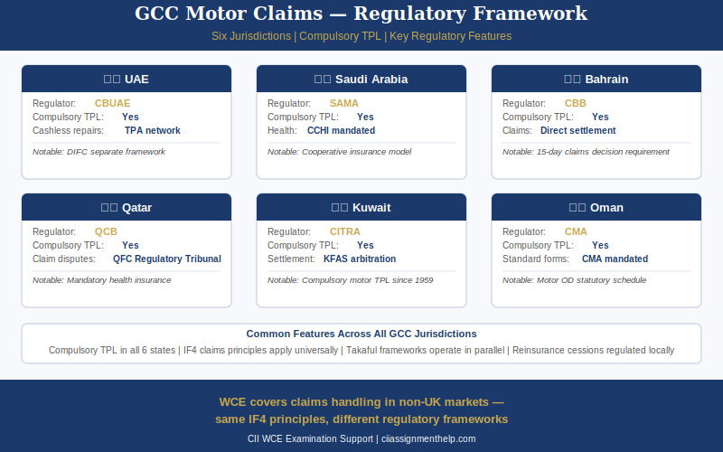

# WCE and WCA Insurance Claims Assignment Help for Non-UK CII Students

The WCE and WCA are the non-UK variants of the CII insurance claims handling unit within the Certificate in Insurance qualification. WCE delivers the assessment in English for international markets outside the United Kingdom; WCA delivers the same assessment content in Arabic for students in Arabic-speaking markets, particularly across the Gulf Cooperation Council (GCC) and the wider MENA region. Both variants assess the same core claims handling principles as the UK-facing IF4 unit — FNOL, investigation, coverage assessment, settlement methods, subrogation, contribution, and fraud detection — adapted for students operating under non-UK regulatory frameworks where FCA rules and ICOBS do not apply. WCE and WCA carry 10 credits within the CII Certificate in Insurance qualification. This service provides structured WCE and WCA exam preparation support in both English and Arabic, with specific expertise in the GCC regulatory environment and IAIS international insurance principles.

---

## What Are the WCE and WCA CII Insurance Claims Units?

WCE and WCA are distinct qualification units — not simply translated versions of IF4. Their purpose is to qualify insurance professionals who handle claims in non-UK markets for a recognised CII credential that reflects their actual operational context.

### WCE — English-Language Claims Handling for Non-UK Markets

WCE is positioned within the CII Certificate in Insurance for candidates outside the United Kingdom. The syllabus structure mirrors IF4 — covering the full claims handling process from first notification through investigation, coverage assessment, and settlement — but the regulatory context applied throughout is non-UK. FCA Consumer Duty, ICOBS 8, the Financial Ombudsman Service referral mechanism, and the Financial Services Compensation Scheme (FSCS) are absent from the WCE syllabus. In their place, WCE references the general principles of insurance conduct derived from common law and contract law — indemnity, subrogation, proximate cause, contribution, and utmost good faith — which apply across all jurisdictions as they pre-date jurisdiction-specific statutory regulation. WCE is available to candidates in any international market where CII qualifications are recognised, including Asia-Pacific, Sub-Saharan Africa, the Caribbean, and South and Southeast Asia.

### WCA — Arabic-Language Claims Handling for Gulf and MENA Students

WCA delivers identical claims handling content to WCE but the examination paper, answer options, scenario text, and all associated CII learning materials are in Arabic. WCA is designed specifically for Arabic-speaking insurance professionals in the GCC states — Saudi Arabia, the United Arab Emirates, Kuwait, Bahrain, Qatar, and Oman — and is also relevant for wider MENA Arabic-speaking markets including Jordan, Egypt, Lebanon, and Morocco. Students working in GCC claims departments already operate in the regulatory environment that WCA tests, which provides a practical advantage in the examination context that equivalent candidates in other markets do not have. Our service provides Arabic-speaking tutors and can deliver assignment guidance and exam preparation in Arabic for WCA candidates who prefer to work in their first language.

---

## Core Claims Principles in WCE and WCA

The claims principles examined in WCE and WCA are identical to those in IF4 — the difference lies in the regulatory overlay applied to each principle, not in the principles themselves. Every claims principle derives from the common law foundations of insurance and applies universally.

### First Notification of Loss (FNOL) and Claims Registration

FNOL is the point at which the policyholder notifies the insurer of an incident that may give rise to a claim. The insurer registers the claim, assigns a reference number, opens a claim file, and initiates the investigation process. In GCC markets, notification timeframes are jurisdiction-specific: the CBUAE Motor Insurance Unified Policy in the UAE requires notification within 24 hours of a motor accident; SAMA and the Insurance Authority in Saudi Arabia set notification conditions within the policy terms. Late notification may prejudice the claim — in most international jurisdictions, including all GCC states, prompt notification is a condition of the policy (condition precedent in some jurisdictions, condition subsequent in others — the distinction determines whether late notification voids the claim entirely or merely reduces the insurer's liability).

### Claims Investigation and Coverage Assessment

Investigation gathers the evidence required to establish facts: what happened, who was responsible, and what the financial extent of the loss is. In GCC motor claims, police reports are mandatory before the insurer will process a third party liability claim — without a police traffic accident report, the claim cannot proceed. For large or complex claims, a loss adjuster is appointed by the insurer to investigate and report. Loss adjuster appointment in GCC markets follows the same insurer-instructed model as in the UK — the loss adjuster reports to and is paid by the insurer.

Coverage assessment applies the same decision logic internationally: is the policy in force? Is the peril insured? Is the proximate cause of loss an insured peril? Are there applicable exclusions? Have policy conditions been met? The proximate cause principle — the dominant, effective cause of loss, not the nearest cause in time — applies universally, derived from the common law authority of *Leyland Shipping v Norwich Union* [1918], which remains instructive even in non-common law jurisdictions because the underlying principle is universal to insurance contract interpretation.

### Settlement Methods in International Insurance Claims

Settlement methods in WCE/WCA are the same four methods as in IF4: cash payment, repair, replacement, and reinstatement. Their application in international markets reflects local market practice:

**Cash indemnity**: Direct payment to the policyholder based on assessed quantum — the most common settlement method in markets where insurer-controlled repair networks do not operate.

**Repair**: The insurer arranges or approves repair. Cashless workshop networks — where the insurer pays the repair garage directly and the policyholder pays only the deductible — are the standard settlement method for motor claims in the UAE and Saudi Arabia. The cashless motor claim settlement process in GCC mirrors the UK approved repairer panel model but is more extensively developed as the dominant settlement route.

**Replacement**: Like-for-like replacement used in total loss situations where a cash settlement based on market value is agreed and the insured sourced the replacement independently — or where the insurer sources an equivalent vehicle directly.

**Reinstatement**: Used in property claims for rebuilding or restoring structures to pre-loss condition. Common in large commercial property losses across the GCC and wider international markets.

**Third Party Administrators (TPAs)**: In GCC health insurance — compulsory for employees in the UAE (Dubai Health Authority; Department of Health, Abu Dhabi) and Saudi Arabia — claims are processed by licensed Third Party Administrators who manage authorisation, processing, and payment on behalf of insurers. TPAs are a significant feature of the GCC health insurance claims landscape that WCE/WCA candidates in those markets will encounter in practice.

### Subrogation and Fraud Detection in Non-UK Claims

**Subrogation**: After indemnifying the policyholder under a valid claim, the insurer acquires all rights and remedies the policyholder held against any negligent third party responsible for the loss. Subrogation derives from the indemnity principle — the insured should not receive more than their actual loss — and applies universally regardless of jurisdiction because it is founded in the common law principles that underpin all insurance contracts. Subrogation rights arise only after the insurer has paid the claim, not before. In the UAE, the CBUAE unified motor policy places specific limits on subrogation rights in third party liability motor claims; in Saudi Arabia, SAMA/IA supervised TP limits define the scope.

**Contribution**: Where two or more policies cover the same risk, the same insured, the same peril, and the same insurable interest, contribution requires each insurer to pay its rateable proportion. This principle applies universally and is tested in WCE/WCA as a coverage assessment outcome — not as a UK-specific rule.

**Fraud indicators in international markets**: The fraud typologies tested in WCE/WCA are the same as in IF4 but assessed without reference to the UK Insurance Fraud Bureau or CIFAS. Staged motor accidents — organised rings coordinating low-speed impacts with phantom passenger injury claims — are prevalent in GCC motor markets, particularly in the UAE and Saudi Arabia. Exaggerated medical expense claims following minor injuries are a common fraud type in markets with compulsory health insurance (UAE, Saudi). Arson in commercial property claims and deliberate damage in marine cargo claims are investigated using the same fraud indicator analysis applied in the UK. The insurer's remedies — policy avoidance where fraud constitutes material misrepresentation at inception, claim repudiation, referral to local law enforcement — apply in all markets.

---

## How WCE and WCA Differ from IF4

The comparison below identifies precisely what changes between the UK unit (IF4) and the non-UK variants (WCE/WCA). Core claims principles are identical — the regulatory architecture differs.

| Factor | IF4 (UK) | WCE / WCA (Non-UK) |
|---|---|---|
| Language | English | English (WCE) / Arabic (WCA) |
| Regulatory framework | FCA, ICOBS 8, Consumer Duty | IAIS ICPs; local regulator (SAMA/IA, CBUAE, CBB, QCB, CMA, etc.) |
| Consumer protection rules | FCA Consumer Duty; FOS right to refer | Varies by jurisdiction — good faith obligations; local ombudsman schemes where available |
| Claims conduct obligations | ICOBS 8 — prompt settlement, clear declination | General principles of fair dealing; jurisdiction-specific policy conditions |
| Complaints escalation | Financial Ombudsman Service — 8-week trigger | No FOS equivalent; internal escalation, insurance ombudsman (India — applicable to IMU/IMP), local regulator |
| Compensation scheme | FSCS (UK statutory protection) | No universal equivalent — country-level solvency requirements; no MENA-wide policyholder protection fund |
| Core claims principles | Indemnity, subrogation, proximate cause, contribution | Identical — unchanged across all jurisdictions |
| Motor TP fraud bodies | Insurance Fraud Bureau (IFR, CIFAS) | Local law enforcement referral; no GCC-wide fraud database equivalent |

The universal principles — indemnity, subrogation, proximate cause, contribution — are unchanged. The regulatory architecture applied to them differs by jurisdiction, and this is precisely what WCE and WCA test.

---

## Non-UK Regulatory Context in Insurance Claims

Insurance regulation in the GCC and wider MENA region is national-level, not regional. There is no GCC-wide equivalent of the FCA. Each state regulates its own insurance market through a separate supervisory authority.

### GCC Insurance Regulators

**Saudi Arabia**: Insurance is regulated by the Insurance Authority (IA), which was established as a standalone supervisory body for the insurance sector. The Saudi Central Bank — SAMA (Saudi Arabian Monetary Authority) — previously exercised supervisory functions over insurance and the two institutions' responsibilities overlap in some areas. Compulsory Third Party Liability (CTPL) motor insurance is mandatory under the Motor Vehicles Accidents Compensation Act. All insurance companies in Saudi Arabia are required to operate on a Takaful (Islamic insurance) basis.

**United Arab Emirates**: The UAE Insurance Authority, which previously regulated the insurance market, was merged into the Central Bank of the UAE (CBUAE) in 2020. The CBUAE now supervises all insurance business in the UAE. The UAE Motor Insurance Unified Policy, issued by the regulator, standardises the core terms of motor cover across all UAE insurers. Medical insurance is compulsory for employees under Dubai Health Authority (DHA) regulations in Dubai and Department of Health (DoH) regulations in Abu Dhabi.

**Bahrain**: The Central Bank of Bahrain (CBB) regulates all financial services including insurance. CBB Resolution 47 of 2014 regulates Takaful operators specifically.

**Kuwait**: Insurance regulation falls under the Ministry of Commerce and Industry. CITRA (Communications and Information Technology Regulatory Authority) has specific responsibilities for digital financial services aspects.

**Qatar**: The Qatar Central Bank (QCB) supervises insurance in Qatar. Compulsory motor third party liability insurance is mandated under Qatari law.

**Oman**: The Capital Market Authority (CMA) regulates the insurance market in Oman.

### IAIS Core Principles as the Global Baseline

The International Association of Insurance Supervisors (IAIS) is the global standard-setting body for insurance regulation. Its Insurance Core Principles (ICPs) represent the baseline framework against which all national insurance regulatory systems are assessed. WCE and WCA exam questions reference principles aligned with IAIS standards rather than FCA-specific rules.

Relevant ICPs for claims handling scenarios:

- **ICP 19 — Conduct of Business**: Requires insurers and intermediaries to treat customers fairly, communicate clearly, and handle claims promptly and equitably. This is the non-UK equivalent of ICOBS in terms of the conduct standard applicable to WCE/WCA scenarios.
- **ICP 18 — Intermediaries**: Covers the conduct obligations of insurance intermediaries — relevant for WCE/WCA scenarios involving brokers and agents in the claims process.
- **ICP 23 — Group-Wide Supervision**: Applies to insurance groups operating across multiple jurisdictions — relevant for WCE/WCA candidates at multinational insurers operating across GCC states.

---

## WCA — Arabic-Language Insurance Claims Exam: What to Expect

The WCA exam is conducted entirely in Arabic. The examination paper, all four answer options for each MCQ, and any case scenario text are presented in Arabic. CII learning materials for WCA — including the core study text and practice questions — are available in Arabic. Candidates who prefer to study in Arabic and sit the examination in Arabic are not disadvantaged relative to WCE candidates; the syllabi are identical.

Key Arabic insurance terminology used in the WCA examination context:

- التأمين (*at-ta'meen*) — insurance
- المطالبة (*al-mutaalaba*) — claim
- التعويض (*at-ta'weed*) — indemnity / compensation
- الحلول محل المؤمن (*al-hulool mahall al-mu'amman*) — subrogation
- السبب القريب (*as-sabab al-qareeb*) — proximate cause
- مُرسِّل الخسائر (*mursil al-khasaa'ir*) — loss adjuster
- الإخطار الأول بالخسارة (*al-ikhtar al-awwal bil-khasara*) — first notification of loss (FNOL)

GCC insurance market familiarity provides a practical advantage in WCA exam scenarios — candidates working in UAE or Saudi claims operations already apply the CBUAE and SAMA/IA regulatory frameworks that the exam references. Our service provides Arabic-speaking tutors and assignment preparation support in Arabic for WCA candidates.

---

## How Is WCE/WCA Assessed?

WCE and WCA are assessed by a multiple-choice examination in the same format as IF4 but shorter in duration, reflecting the 10-credit (rather than 15-credit) unit weight.

- **Format**: Multiple-choice examination — one correct answer from four options per question
- **Number of questions**: Typically 50 questions
- **Duration**: 1 hour
- **Pass mark**: 65% (CII Certificate in Insurance standard pass mark)
- **Delivery**: Computer-based test at an authorised CII examination centre — available internationally, including at CII-approved centres in GCC states

**Exam technique for WCE/WCA MCQ scenarios**: Read each scenario carefully and identify the specific claims principle being tested before reading the four options. The distractors in WCE/WCA scenarios typically apply the correct principle to the wrong facts, or substitute a UK-specific regulatory rule (FOS referral, FSCS protection, ICOBS 8) for the correct non-UK answer. Eliminate any option that references FCA, ICOBS, Consumer Duty, FOS, or FSCS as the operative rule — these are wrong answers in WCE/WCA. Focus on what the claims handler must do under the universal principle or the applicable local regulatory context described in the scenario.

> **Need expert help with your WCE or WCA exam?** Contact us today for structured exam preparation support.

---

## How Do Insurance Claims Principles Apply Across Different Regulatory Systems?

The core principles of indemnity, subrogation, proximate cause, and contribution derive from common law and contract law foundations that pre-date jurisdiction-specific insurance regulation. Whether a claim is handled under ICOBS in the UK, under SAMA rules in Saudi Arabia, or under CBUAE guidelines in the UAE, the underlying principle that an insured should not profit from insurance — the principle of indemnity — remains constant. What changes is the procedural framework: notification windows, dispute resolution routes, compensation scheme access, and the specific conduct rules that the local regulator imposes. This is precisely what WCE and WCA test: can the candidate apply universal claims principles correctly within a non-UK operational context, without importing UK-specific regulatory rules that do not apply?

---

## WCE/WCA and the CII Certificate in Insurance Pathway

The CII Certificate in Insurance is the foundational qualification level offered by the Chartered Insurance Institute, recognised internationally by insurers, intermediaries, and regulators in over 150 countries. WCE and WCA sit within the Certificate alongside other non-UK variant units designed for international markets.

WCE and WCA each contribute 10 credits at Level 3 toward the credit total required for the Cert CII designation. The Certificate in Insurance requires a minimum number of credits to achieve the qualification — students should confirm the precise credit requirement against the current CII unit guide. Completion of the Certificate in Insurance enables progression to the CII Diploma in Insurance, where students may take Diploma-level units including M05 (Insurance Law), M92 (Insurance Business and Finance), and 530 (Economics and Business) for a broader and deeper professional qualification.

For [CII Certificate in Insurance assignment help] across all units including international variants, this service provides structured exam preparation at all levels.

---

## Takaful Claims: Where WCA Intersects with Islamic Insurance

Takaful is the Islamic insurance model operating across GCC markets — all insurance companies in Saudi Arabia are required to operate on a Takaful basis; Takaful is also the dominant model in Bahrain and is widely used in the UAE and Kuwait. WCA candidates in Saudi Arabia and the wider GCC will encounter Takaful claims handling in practice.

Under the Takaful model, policyholders are participants who contribute to a mutual risk fund through Tabarru' (donation) contributions rather than paying premiums to an insurer that bears risk. Claims are paid from the Takaful fund, not from the insurer's own capital. The operator manages the fund on behalf of participants under either a Wakalah (agency fee) structure — the operator receives a fixed management fee regardless of fund performance — or a Mudarabah (profit-sharing) structure — the operator shares in the surplus of the fund.

The claims handling process in Takaful follows the same principles as conventional insurance — FNOL, investigation, coverage assessment, settlement — but the contractual relationship differs: participant versus policyholder; fund versus insurer bearing risk; operator as manager rather than underwriter. Surplus distribution — returning unspent contributions to participants at year-end — is a Takaful-specific concept that has no conventional insurance equivalent.

WCA candidates in Saudi Arabia operate exclusively in a Takaful claims environment and benefit from understanding the Takaful fund mechanics alongside the universal claims principles. Understanding Takaful claims is complementary context for the WCA examination and connects to the [CII 590 Takaful unit] for candidates who wish to develop specialist Takaful expertise beyond the Certificate level.

---

## How Our CII Assignment Help Service Supports WCE and WCA Students

This service provides structured assignment guidance and exam preparation support for WCE and WCA candidates across all international markets.

**Unit-specific exam preparation**: Structured walkthroughs of scenario-based practice questions aligned to the WCE/WCA syllabus, covering FNOL procedures, coverage assessment decision logic, settlement method selection, subrogation timing, and fraud indicator identification — all in the non-UK regulatory context.

**Non-UK regulatory expertise**: Our team understands the GCC insurance environment — SAMA/IA in Saudi Arabia, CBUAE in the UAE, CBB in Bahrain — and the IAIS ICP framework that underpins WCE/WCA examination questions. We do not apply UK-specific rules to non-UK scenarios.

**Arabic-language support**: Arabic-speaking advisors are available for WCA candidates who prefer to discuss concepts, work through scenarios, or receive examination preparation guidance in Arabic.

**Flexible scheduling**: Support is available for students across Gulf Standard Time (GST/+4) and Arabia Standard Time (AST/+3) zones, covering peak study hours across the GCC.

For [CII insurance assignment help] at all qualification levels, including Certificate, Diploma, and Advanced Diploma, this service provides expert support across all units and market variants.

---

## Frequently Asked Questions — WCE and WCA

**Q: Is the WCA exam actually taken in Arabic?**

Yes. The WCA is the Arabic-language version of the CII insurance claims handling unit. The full examination paper — questions, answer options, and any supporting scenario text — is in Arabic. CII learning materials are available in Arabic for WCA candidates. Our tutors can provide complete exam preparation support in Arabic for WCA students, including scenario walkthroughs, practice MCQs, and concept explanations in Arabic.

**Q: Does WCE or WCA cover FCA rules?**

No. Neither WCE nor WCA covers FCA regulation, ICOBS, the Consumer Duty, the Financial Ombudsman Service, or any other UK Financial Conduct Authority instrument. Both units assess claims handling principles in the context of non-UK regulatory environments. Students should focus on universal insurance principles — indemnity, subrogation, proximate cause, contribution — and the regulatory context of their own market, not on UK-specific regulatory rules. Any answer option in a WCE/WCA MCQ scenario that references ICOBS, the FOS 8-week rule, or Consumer Duty as the operative rule is a wrong answer.

**Q: Can I take WCE if I am not based in a GCC country?**

Yes. WCE is the English-language non-UK variant and is available to candidates in any international market outside the UK — it is not limited to GCC or MENA candidates. Insurance professionals in Asia-Pacific, Sub-Saharan Africa, the Caribbean, and other international markets take WCE as part of their CII Certificate in Insurance where the IF4 UK variant is not the appropriate unit for their market context.

**Q: How many credits are WCE and WCA worth?**

Both WCE and WCA are worth 10 credits within the CII Certificate in Insurance qualification framework. This is lower than the 15-credit value of IF4 — students building the Certificate in Insurance should factor the credit weight into their qualification planning to ensure they reach the minimum credit total required for the Cert CII designation.

**Q: What is the difference between WCE/WCA and IF4?**

IF4 is the UK-market version of the insurance claims handling unit, covering FCA regulation, ICOBS, the Financial Ombudsman Service, and the FSCS. WCE and WCA are the non-UK equivalents assessing identical core claims principles in a non-UK regulatory context. The universal claims principles — FNOL, investigation, coverage assessment, settlement methods, subrogation, fraud indicators — are the same across IF4, WCE, and WCA. The difference is the regulatory framework applied to them: IF4 references FCA/ICOBS; WCE and WCA reference IAIS ICPs and applicable local GCC or international regulators.

**Q: Do GCC countries have equivalent insurance compensation schemes to the UK FSCS?**

No. The UK Financial Services Compensation Scheme (FSCS) is a UK-specific statutory mechanism protecting policyholders when an authorised insurer fails. GCC countries do not have a direct regional equivalent. Individual regulators — CBUAE, SAMA/IA, CBB — impose solvency margin requirements on insurers to reduce insolvency risk, and regulators may intervene to transfer policies or protect policyholders in the event of insurer failure. Some GCC markets have policyholder protection fund frameworks under development, but no GCC-wide FSCS equivalent currently exists. WCE/WCA candidates should be aware that the FSCS is not referenced in their examination — any answer option citing the FSCS as the applicable protection mechanism in a WCE/WCA scenario is a wrong answer.
